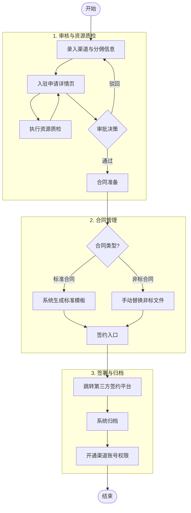
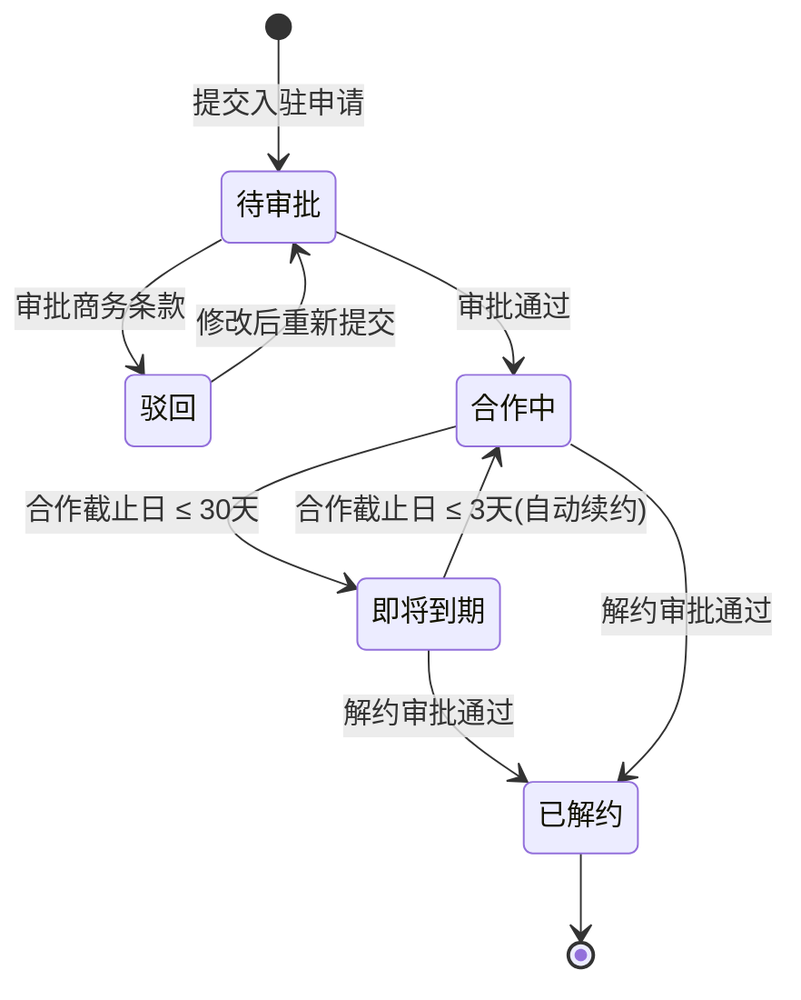
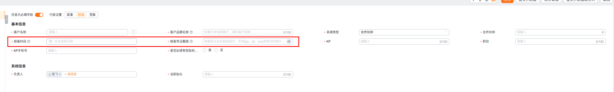
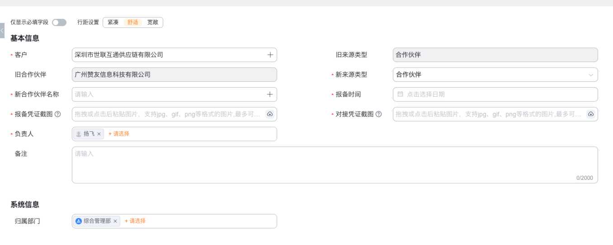
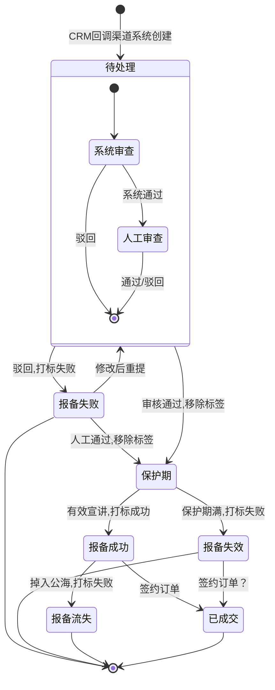
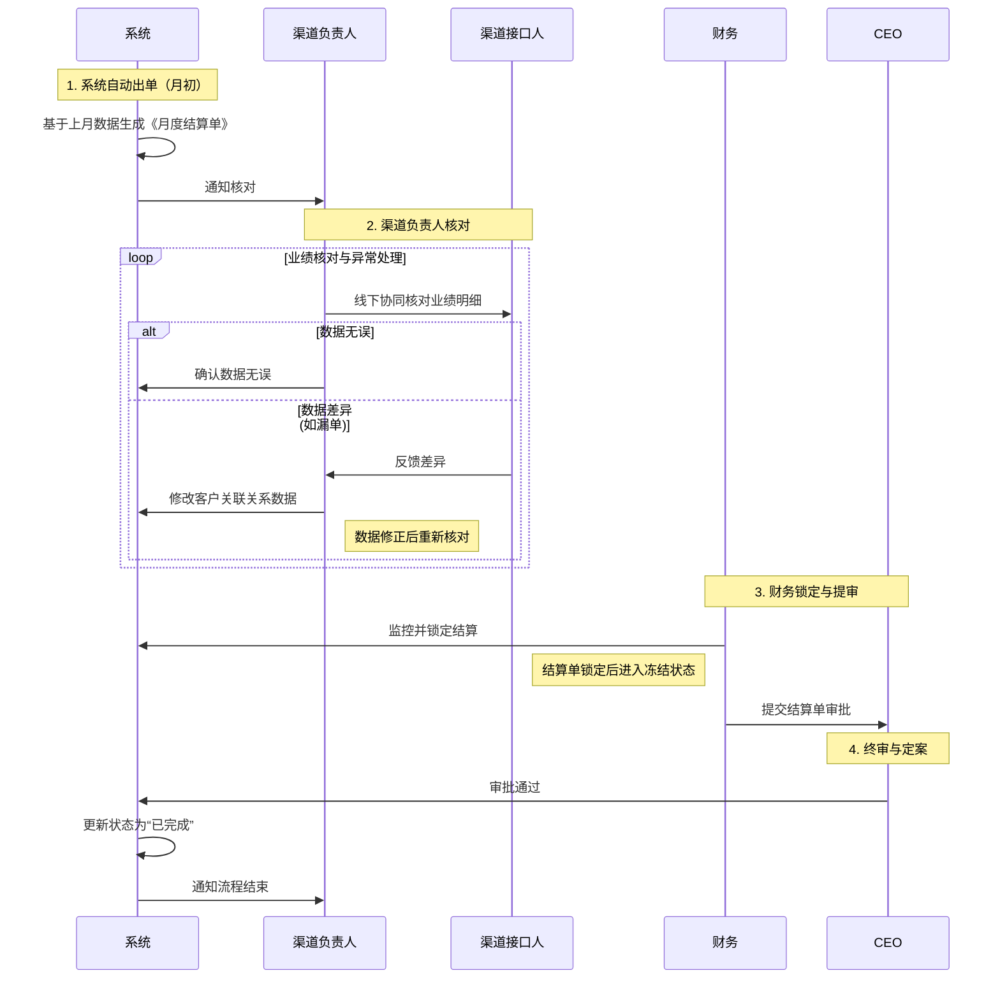

# 渠道管理系统产品需求文档 (PRD)

## 1. 项目背景与目标

### 1.1 业务背景

公司通过渠道合作伙伴拓展市场，当前渠道管理存在以下痛点：

- **渠道准入混乱**：缺乏标准化的入驻审批流程，资质审核依赖线下沟通。
- **客户归属争议**：渠道间撞单频繁，缺乏有效的客户保护机制。
- **业绩核算滞后**：人工统计业绩与分佣，易出错且效率低。

### 1.2 功能目标

构建渠道管理系统，覆盖从渠道招募入驻、客户报备保护、业绩自动核算到合作终止的核心流程。

### 1.3 适用对象

产品经理、开发工程师、测试工程师、业务负责人。

---

## 2. 角色与权限

| 角色       | 职责描述                                             | 核心操作权限                                       |
| ---------- | ---------------------------------------------------- | -------------------------------------------------- |
| 渠道接口人 | 渠道方的人员，负责日常的客户报备工作，渠道的对接工作 | 发起入驻、录入报备、核对月度业绩                   |
| 渠道负责人 | 影刀方的渠道管理人员，负责渠道的引入与报备发起       | 发起入驻、录入报备、核对月度业绩、发起调账/解约    |
| 渠道TL     | 业务管理者，把控准入评审与审批                       | 入驻审批、报备评审（查重）、业绩调账审批、解约审批 |
| 渠道中台   | 规则监督者                                           | 日常数据巡检、规则配置维护、渠道合同审批           |

---

## 3. 总体架构

### 3.2 核心业务流程

#### 3.2.1 渠道入驻与合同管理流程

**渠道状态流转**

#### 3.2.2 客户报备流程

**流程说明**：渠道负责人带领客户发起客户报备，需录入客户基本信息（工商名称、关键联系人等）。提交后由对应渠道的“渠道负责人”进行评审和查重评估。若客户已存在则报备失败；若不存在则在 CRM 中创建客户。销售完成宣讲后视为报备成功。

**销售报备流程**

1. 渠道接口人提供客户报备信息给影刀销售
2. 销售在crm中创建客户，在客户下录入渠道的报备相关信息。
   
3. 销售在crm公海中认领了客户，需要通过现有的审批流程"申请变更 - 客户来源类型"修改客户关联的合作伙伴
   > 目前crm中审批流通过后，系统自动调整
   > 
4. 在创建客户或通过审批流把客户关联的渠道后，CRM系统回调渠道系统创建客户报备信息。
   > 客户报备信息创建后，需要自动创建报备任务
   > 客户报备信息字段：客户名称、关联渠道、报备时间、报备截图、联系人、联系电话、联系人职位、关联销售(可选)
5. 渠道系统自动审查客户报备是否合规，不合规则自动失败。
   > 业务规则：
   >
   > 1. 客户名称需要在企查查中存在。注：海外客户如何报备？失败后去修改客户报备记录
   > 2. 自动审查不通过，会给销售发送一条飞书通知
6. 渠道负责人审查客户报备是否合规，审查通过后为保护期。
   > 业务规则：
   >
   > 1. 审查点为报备信息是否为有效报备信息
   > 2. 审查通过后，发送消息给对应的销售
   > 3. 待确认：审查不通过，移除客户关联的渠道，客户来源修改为自开拓

**渠道负责人报备流程**

1. 渠道接口人提供客户报备信息给影刀渠道负责人，走"销售报备流程"。
2. 渠道负责人首先在 CRM 进行查重判断：
   - **客户已存在且在跟进中**：流程终止，不予报备（撞单）。
   - **客户已存在但无跟进（公海）**：这个场景一般就是客户报备信息给到销售，走"销售报备流程"。
   - **客户不存在**：渠道负责人在 CRM 中创建客户（客户初始归属于渠道负责人），并关联渠道。
3. 在创建客户或领取客户后，CRM 系统回调渠道系统创建客户报备信息。
   > 客户报备信息创建后，需要自动创建报备任务
   > 客户报备信息字段：客户名称、关联渠道、报备时间、报备截图、联系人、联系电话、联系人职位、关联销售(可选)
4. 渠道系统自动审查客户报备是否合规，不合规则自动失败。
   > 业务规则：
   >
   > 1. 客户名称需要在企查查中存在。注：海外客户如何报备？
   > 2. 自动审查不通过，会给渠道负责人发送飞书通知。
   > 3. 待确认：审查不通过，移除客户关联的渠道，客户来源修改为自开拓
5. 渠道负责人在 CRM 中将客户**转移**给对接的销售进行跟进。

**客户报备有效判断流程**

1. 客户报备成功后需要在保护期内(500人以下或为空可以保护7天，500人及以上的可以保护15天)进行有效的跟
2. 如果客户在保护期内，销售有宣讲类型的跟进记录，则记为有效报备，否则记为无效报备。
3. 预留一个有效报备的申述入口，可以通过申请，提交资料，审批后修改为有效报备。
   > 客户报备在临近保护期的前3天，上午9点发送通知给渠道负责人(不发通知，因为当前阶段无操作)
   > 报备修改审批通过后，修改CRM中客户的来源为合作伙伴并关联对应渠道。

有效报备判断逻辑：

1. 有效跟进判断逻辑：根据客户下的销售跟进记录来判断，需要跟进记录类型为宣讲，且创建宣讲记录的时候，客户已经和渠道关联上。这个标签可以先打上，但是不一定使用。
2. 如果客户关联上渠道，则存在审批中的报备任务，客户名称和报备的客户名称一致，则自动报备成功。
3. 如果客户报备关联的客户A，被合并进入了另外一个客户B下，且客户B也关联了这个渠道，则在客户B的订单，也会算作客户订单。

问题：如果没有报备任务，但是客户关联了渠道，是否算作报备成功？目前是没有这个逻辑，只要客户关联了渠道，然后成单，就算作渠道的订单。

#### 3.2.2.1 客户报备状态

**报备状态流转**

客户报备状态说明：

| 状态         | 说明                                                       | 触发/变更逻辑                                                |
| ------------ | ---------------------------------------------------------- | ------------------------------------------------------------ |
| **待处理**   | 报备任务已创建，等待**系统自动审查**及**负责人人工评审**。 | CRM 产生关联时的初始状态；或失败后重新提交。                 |
| **报备失败** | 报备不合规、存在冲突或被人工驳回。                         | **系统自动审查**不通过（如企查查无数据）或**人工评审**驳回。 |
| **保护期**   | 报备通过评审，进入权益保护计时（7/15天）。                 | 渠道负责人人工评审通过。                                     |
| **报备成功** | 报备权益正式由于有效跟进（宣讲完成）而生效。               | 在保护期内完成宣讲类跟进，且经系统判定有效。                 |
| **报备失效** | 报备权益在保护期内未达标而自动解除。                       | 保护期届满仍未完成宣讲，报备失效。                           |
| **报备流失** | 曾报备成功的客户资源因掉库而解除关联。                     | 报备成功后，客户掉入 CRM 公海，系统自动移除关联。            |
| **已成交**   | 报备成功且最终达成业务合同签约并回款。                     | 报备成功后，客户产生已签约的订单（OMS 同步）。               |

**客户状态流转业务流程说明**

1. **报备任务生成**：当客户在 CRM 中被创建或关联到渠道时（无论是通过销售录入还是渠道负责人录入），系统回调生成客户报备任务，状态初始为 **待处理**。
2. **系统自动审查**：渠道系统首先进行自动化规则校验（例如：验证客户名称是否在企查查中存在）。
   - **审查不通过**：系统自动判定失败，状态流转为 **报备失败**（并通知相关人员）。
   - **审查通过**：自动进入人工评审阶段，状态保持 **待处理**。
3. **人工查重与评审**：渠道负责人对报备信息的有效性及冲突情况进行最终判定。
   - **评审驳回**：判定为无效报备或撞单，状态流转为 **报备失败**。
     > 失败后允许修改报备信息并重新提交，状态将重置为 **待处理**。
   - **评审通过**：确认报备有效，状态流转为 **保护期**。
4. **保护期权益流转**：
   - **完成宣讲**：销售在保护期内完成有效宣讲记录，状态流转为 **报备成功**。
   - **到期未宣讲**：保护期结束（7天/15天）仍无有效跟进，状态流转为 **报备失效**，保护权益解除。
5. **后续状态流转**：
   - **已成交**：OMS 同步该客户产生了已签约的订单，状态流转为 **已转化**。
   - **报备流失**：客户因长期未跟进掉入 CRM 公海，系统自动移除关联，状态流转为 **报备流失**。

#### 3.2.3 月度结算流程

**月度结算流程说明**

1. **系统自动出单（月初）**
   每月初，系统基于上月生效的业绩数据与渠道签约的分佣规则（标准/非标/阶梯等），自动计算并生成上月的《月度结算单》，同时通知渠道负责人。

2. **渠道负责人核对**
   渠道负责人需协同渠道接口人对业绩明细进行确认：
   - **核对确认**：数据无误，线下核对（通常已与外部渠道接口人确认一致）
   - **异常处理**：若发现数据差异（如漏单等），渠道接口人线下和渠道负责人对接，修改客户关联关系数据。

3. **财务锁定与提审**
   财务人员监控核对进度，确认无误后执行**锁定结算**操作，并将结算单提交至 CEO 审批。

   > **注意**：结算单一旦锁定，即进入冻结状态，客户、合同、费用等业务的变更，不会对结算单产生影响。

4. **终审与定案**
   CEO 审批通过后，系统将结算单状态更新为“已完成”，并通知渠道负责人。流程随后进入请款/开票/打款等资金结算阶段。

## CRM规则调整总结

1. 客户回到公海的时候，移除客户关联的合作伙伴
2. 新建客户时，如果来源类型是合作伙伴，需要录入关联渠道相关信息
3. "申请变更 - 客户来源类型"审批流通过后，需要自动调整客户关联的客户来源类型
4. 销售记录增加关联的渠道字段，在录入时，自动把客户当前关联的渠道填入销售记录中，用作后续数据分析。

## 业务上需要确认的点

1. 渠道的结算逻辑是不是就四种：影刀默认阶梯、自定义阶梯业绩、固定提成比例、聚水潭。
   > 确定
2. 渠道的合同都需要进系统，在系统中的合同，可以自动按照上面四大类把结算信息提取出来。
   > 需要业务方协作
3. 目前没有渠道签约周期的数据，需要渠道负责人补录。
   > 需要业务方协助，正式上线前补录完成
4. 需要渠道负责人最终确认&补录：渠道结算规则、渠道签约周期
   > 需要业务方协助，正式上线前补录完成
5. 报备成功后，客户掉回公海就自动移除渠道关联。但与"已转化"状态矛盾：如果已签约订单后客户掉回公海，订单归属怎么处理？
   > 理论上，已成交客户，应该不会掉回到公海
6. 考虑到海外客户也会创建客户，是否还做企查查的来源校验？
