# 渠道管理系统产品需求文档 (PRD)

## 1. 项目背景与目标

### 1.1 业务背景

公司通过渠道合作伙伴拓展市场，当前渠道管理存在以下痛点：

- **渠道准入混乱**：缺乏标准化的入驻审批流程，资质审核依赖线下沟通。
- **客户归属争议**：渠道间撞单频繁，缺乏有效的客户保护机制。
- **业绩核算滞后**：人工统计业绩与分佣，易出错且效率低。

### 1.2 功能目标

构建渠道管理系统，覆盖从渠道招募入驻、客户报备保护、业绩自动核算到合作终止的核心流程。

### 1.3 适用对象

产品经理、开发工程师、测试工程师、业务负责人。

---

## 2. 角色与权限

| 角色 | 职责描述 | 核心操作权限 |
| --- | --- | --- |
| 渠道负责人 | 一线执行者，负责渠道的引入与日常维护 | 发起入驻、新增报备、核对月度业绩、发起调账/解约 |
| 渠道 Leader | 业务管理者，把控准入与审批 | 入驻审批、业绩调账审批、解约审批 |
| 售前中台 | 资源与规则监督者 | 客户报备核审（防撞单）、日常数据巡检 |
| 财务/CEO | 业绩把控者 | 月度结算单复核/终审 |

---

## 3. 总体架构

### 3.1 页面结构图（站点地图）

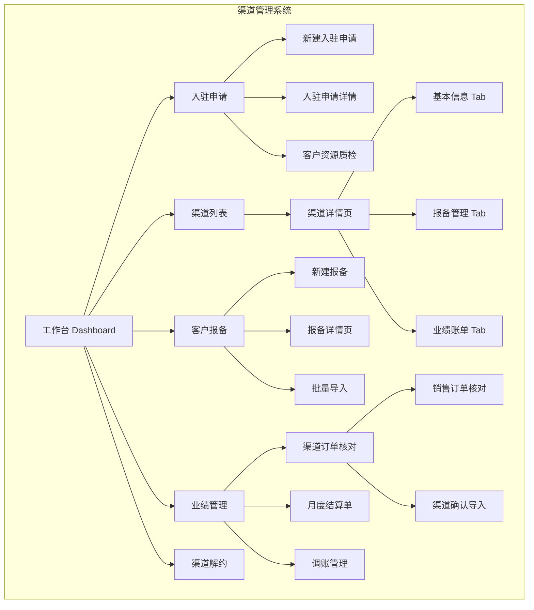

### 3.2 核心业务流程

#### 3.2.1 渠道入驻流程

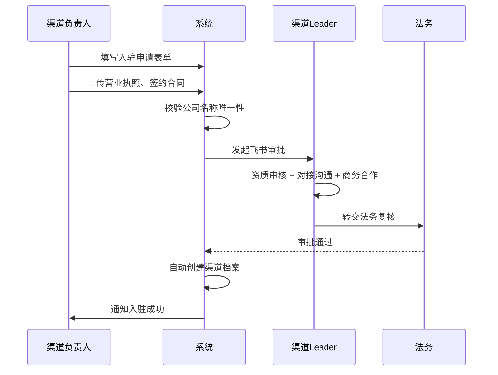

#### 3.2.2 客户报备流程

> **流程说明**：本系统直接在客户维度与CRM系统（分销逍客）打通，不需要从线索开始。入口为商机渠道管理系统。CRM已存在客户时走"来源更改"分支。

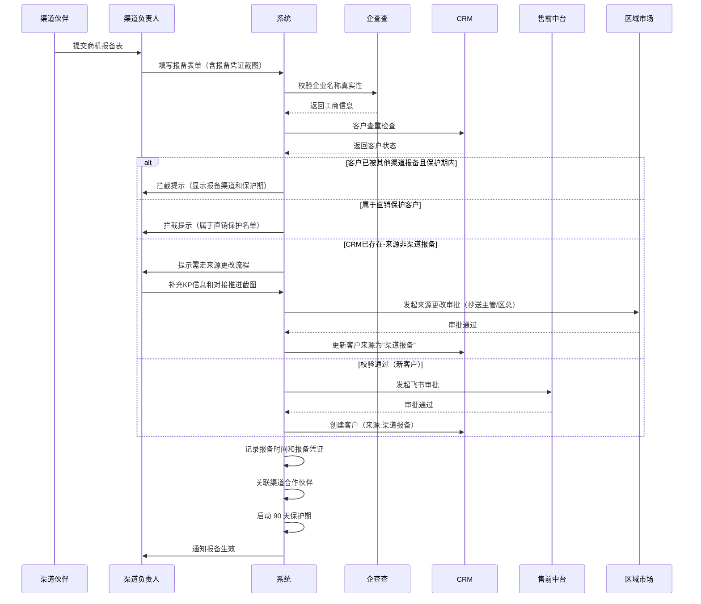

#### 3.2.3 月度结算流程

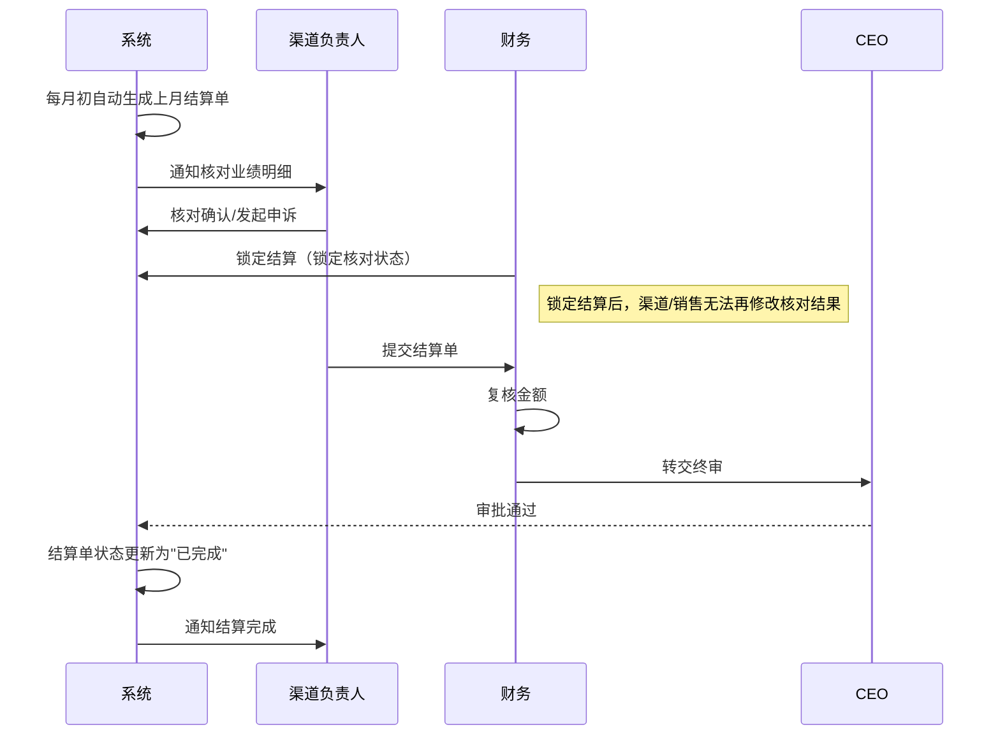

### 3.3 渠道状态流转

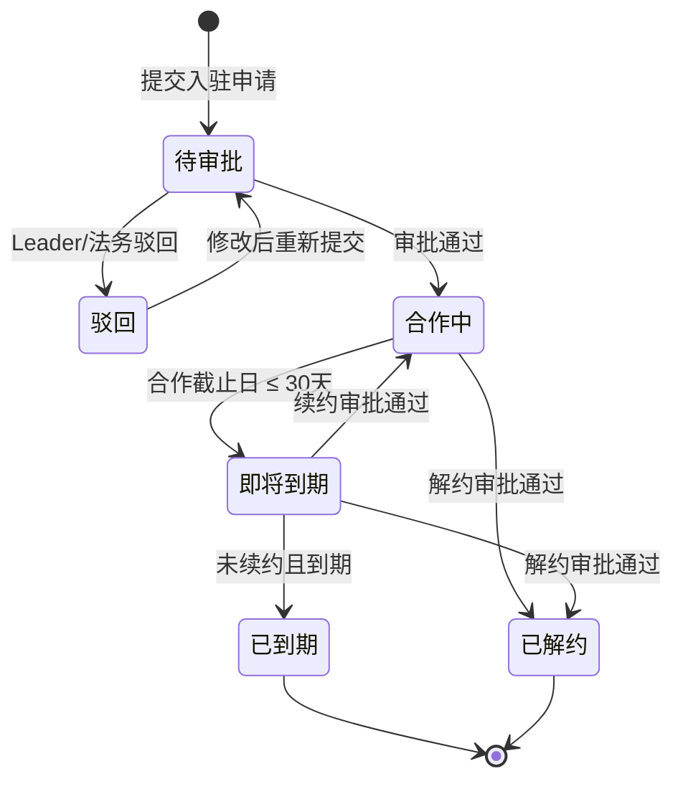

### 3.4 报备状态流转

> **说明**：新客户报备由售前中台审批；CRM已存在客户（来源更改）由区域市场审批。两种情况审批通过后状态流转一致。

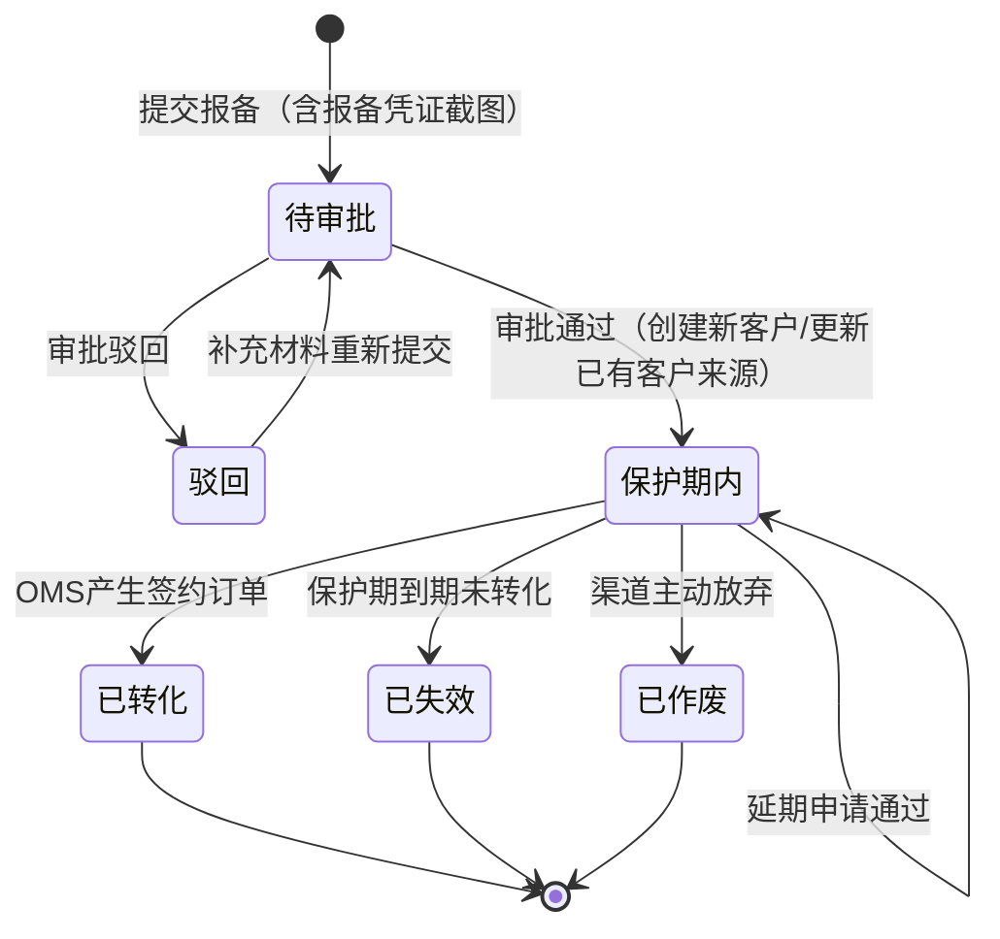

---

## 4. 页面功能详情

### 4.1 工作台 Dashboard (P0)

#### 页面入口

- **默认首页**：登录系统后默认展示。
- **菜单入口**：左侧菜单顶部"工作台"图标，点击可随时返回。

#### UI 元素与展示规则

**4.1.1 顶部欢迎区域**

| 元素 | 展示规则 |
| --- | --- |
| 欢迎语 | "👋 你好，{用户姓名}！" |
| 日期 | 格式：YYYY年M月D日，星期X |

**4.1.2 待办事项区域**

| 待办类型 | 触发条件 | 展示文案 |
| --- | --- | --- |
| 合作即将到期 | 渠道合作截止日 ≤ 30 天 | "【渠道名称】将于 X 天后到期，请及时续约" |
| 报备即将失效 | 报备保护期 ≤ 7 天 | "【客户名称】报备保护期将于 X 天后失效" |
| 月度结算待核对 | 结算单状态为"待核对" | "X月结算单已生成，请核对确认" |
| 入驻审批被驳回 | 入驻申请状态为"驳回" | "【渠道名称】入驻申请已驳回，请修改后重新提交" |

- **空状态**：无待办时显示"🎉 暂无待办事项，继续保持！"
- **数量限制**：默认展示最多 5 条，超出显示"查看全部待办（N条）"链接。

**4.1.3 核心指标卡片区域**

第一行（渠道指标）：

| 卡片名称 | 数据口径 | 样式 |
| --- | --- | --- |
| 负责渠道数 | 当前用户作为负责人的渠道总数 | 默认 |
| 合作中渠道 | 状态为"合作中"的渠道数量 | 默认 |
| 即将到期 | 合作截止日 ≤ 30 天的渠道数量 | 红色高亮 |
| 本月新入驻 | 本月审批通过的入驻申请数量 | 默认 |

第二行（报备指标）：

| 卡片名称 | 数据口径 | 样式 |
| --- | --- | --- |
| 报备客户总数 | 当前用户所负责渠道的报备客户总数 | 默认 |
| 保护期内 | 报备状态为"保护期内"的数量 | 默认 |
| 已转化 | 报备状态为"已转化"的数量 | 绿色高亮 |
| 本月新增报备 | 本月新提交的报备数量 | 默认 |

**4.1.4 渠道业绩概览**

| 图表类型 | 展示数据 | 说明 |
| --- | --- | --- |
| 柱状图 | 各渠道本周期累计业绩 | X轴：渠道名称，Y轴：业绩金额，按业绩降序排列 |
| 环形图 | 渠道等级分布 | 仅统计"阶梯等级"类型渠道的金牌/银牌/铜牌占比，固定比例/个性化渠道不纳入统计 |

**4.1.5 报备客户漏斗**

漏斗阶段：总报备数 → 跟进中 → 关联客户 → 商机中 → 已成单 → 已签约 → 已回款

**4.1.6 近期动态时间线**

| 动态类型 | 触发场景 | 展示格式 |
| --- | --- | --- |
| 入驻通过 | 入驻申请审批通过 | "🎉 【渠道名称】入驻审批通过" |
| 报备生效 | 客户报备审批通过 | "✅ 【客户名称】报备已生效，保护期至 XX-XX" |
| 商机推进 | 报备客户商机阶段变更 | "📈 【客户名称】商机阶段更新为【已成单】" |
| 订单签约 | 同步签约订单 | "🎯 【客户名称】已签约，合同金额 XX 万" |
| 回款到账 | 同步回款记录 | "💰 【客户名称】回款到账 XX 万" |

- **展示数量**：默认展示最近 10 条，滚动到底部自动加载更多。

#### 操作与交互逻辑

| 操作 | 交互反馈 |
| --- | --- |
| 点击待办卡片 | 跳转至对应详情页 |
| 点击指标卡片 | 跳转至对应列表页（自动填充筛选条件） |
| 柱状图 hover | 显示渠道名称、累计业绩、当前等级 |
| 柱状图点击 | 跳转至对应渠道详情页 |
| 漏斗 hover | 显示当前阶段数量及转化率 |
| 漏斗点击 | 跳转至客户报备列表（筛选对应状态） |
| 时间切换下拉 | 切换"本周期/上周期"或"本月/本季度/本年度" |

#### 异常状态处理

| 场景 | 处理方式 |
| --- | --- |
| 数据加载中 | 各区域显示骨架屏（Skeleton），避免页面抖动 |
| 数据加载失败 | 对应区域显示"数据加载失败，[重试]"，点击重试单独刷新该区域 |
| 无负责渠道 | 隐藏渠道相关指标卡片和业绩图表，提示"您暂无负责的渠道，[去申请入驻]" |
| 无报备客户 | 报备漏斗区域显示"暂无报备数据，[去新建报备]"引导操作 |

#### 页面布局示意

```
┌─────────────────────────────────────────────────────────────────────────────────────────┐
│  👋 你好，张三！今天是 2026年1月13日，星期二                                              │
├─────────────────────────────────────────────────────────────────────────────────────────┤
│  待办事项                                                          [查看全部待办 (8)]   │
│  ┌─────────────────────────────────────────────────────────────────────────────────┐   │
│  │ ⚠️ 【成都XX科技】将于 5 天后到期，请及时续约                              [去处理]│   │
│  │ ⚠️ 【四川都九成商贸】报备保护期将于 3 天后失效                            [去处理]│   │
│  │ 📋 12月结算单已生成，请核对确认                                          [去核对]│   │
│  └─────────────────────────────────────────────────────────────────────────────────┘   │
├─────────────────────────────────────────────────────────────────────────────────────────┤
│  核心指标                                                                                │
│  ┌──────────────┐ ┌──────────────┐ ┌──────────────┐ ┌──────────────┐                   │
│  │  负责渠道数   │ │  合作中渠道   │ │  即将到期 🔴  │ │  本月新入驻   │                   │
│  │     12      │ │     10      │ │      2      │ │      1      │                   │
│  └──────────────┘ └──────────────┘ └──────────────┘ └──────────────┘                   │
│  ┌──────────────┐ ┌──────────────┐ ┌──────────────┐ ┌──────────────┐                   │
│  │  报备客户总数  │ │   保护期内    │ │  已转化 🟢    │ │  本月新增报备  │                   │
│  │     156     │ │     89      │ │     42      │ │     12      │                   │
│  └──────────────┘ └──────────────┘ └──────────────┘ └──────────────┘                   │
├─────────────────────────────────────────────────────────────────────────────────────────┤
│  ┌─────────────────────────────────────┐  ┌─────────────────────────────────────┐      │
│  │ 渠道业绩概览            [本周期 ▼]   │  │ 报备转化漏斗           [本年度 ▼]   │      │
│  │ ┌─────────────────────────────────┐│  │ ┌─────────────────────────────────┐│      │
│  │ │  █████████  成都XX科技  120万    ││  │ │ ████████████████████  156 总报备 ││      │
│  │ │  ███████    杭州YY信息   85万    ││  │ │ ██████████████████    128 跟进中 ││      │
│  │ │  █████      北京ZZ科技   50万    ││  │ │ ████████████████       98 关联客户││      │
│  │ │  ████       上海AA公司   40万    ││  │ │ ████████████           72 商机中 ││      │
│  │ │  ███        深圳BB企业   25万    ││  │ │ ██████████             56 已成单 ││      │
│  │ └─────────────────────────────────┘│  │ │ ████████               42 已签约 ││      │
│  │ 等级分布：🥇金牌 2  🥈银牌 5  🥉铜牌 5 │  │ │ ██████                 28 已回款 ││      │
│  └─────────────────────────────────────┘  │ └─────────────────────────────────┘│      │
│                                           │ 整体转化率：17.9%                   │      │
│                                           └─────────────────────────────────────┘      │
├─────────────────────────────────────────────────────────────────────────────────────────┤
│  近期动态                                                                                │
│  ┌─────────────────────────────────────────────────────────────────────────────────┐   │
│  │ 🎯 10:30  【四川都九成商贸】已签约，合同金额 50 万                                 │   │
│  │ 📈 09:15  【成都米仓山电子】商机阶段更新为【商机中】                               │   │
│  │ ✅ 昨天   【成都阿晋卖料供应链】报备已生效，保护期至 2026-04-12                    │   │
│  │ 🎉 昨天   【重庆CC科技有限公司】入驻审批通过                                      │   │
│  │ 💰 3天前  【杭州DD信息技术】回款到账 30 万                                       │   │
│  └─────────────────────────────────────────────────────────────────────────────────┘   │
└─────────────────────────────────────────────────────────────────────────────────────────┘
```

---

### 4.2 入驻申请 (P0)

#### 页面入口

- **主入口**：左侧菜单"入驻申请"。
- **快捷入口**：工作台"本月新入驻"指标卡片点击跳转。

#### 4.2.1 入驻申请列表页

##### UI 元素与展示规则

**查询区字段**：

| 字段 | 类型 | 说明 |
| --- | --- | --- |
| 渠道名称 | 文本输入 | 模糊匹配 |
| 审批状态 | 下拉单选 | 全部/待审批/审批中/驳回/通过 |
| 负责人 | 下拉单选 | 筛选特定负责人 |
| 申请时间 | 日期范围 | 起止日期选择 |

**列表展示字段**：

| 字段 | 说明 |
| --- | --- |
| 申请单号 | 系统自动生成，点击跳转详情 |
| 渠道名称 | 公司全称 |
| 影刀负责人 | 内部负责人姓名 |
| 申请时间 | 提交时间 |
| 审批状态 | 待审批（蓝色）/审批中（橙色）/驳回（红色）/通过（绿色） |

**操作按钮**：

| 按钮 | 可见条件 | 点击行为 |
| --- | --- | --- |
| 查看详情 | 始终可见 | 跳转入驻申请详情页 |
| 修改 | 状态为"驳回" | 进入编辑模式，修改后可重新提交 |
| 质量检查 | 已提交客户资源证明 | 跳转客户资源质检页面 |

##### 操作与交互逻辑

| 操作 | 交互反馈 |
| --- | --- |
| 点击【查询】 | 按钮置灰显示 Loading，刷新列表，保留筛选条件 |
| 点击【重置】 | 清空所有筛选条件，恢复默认值 |
| 点击【新建入驻申请】 | 跳转新建表单页 |
| 点击【下载合同模板】 | 下载《20231204-影刀营销合作协议书-标准合同.docx》 |

##### 异常状态处理

| 场景 | 处理方式 |
| --- | --- |
| 列表为空 | 显示"暂无入驻申请记录，[新建入驻申请]" |
| 加载失败 | 显示"数据加载失败，[重试]" |

#### 4.2.2 新建入驻申请页

##### UI 元素与展示规则

**智能解析区**：
- 页面顶部集成【智能解析】功能按钮。
- 支持上传营业执照图片，自动识别并填充工商信息。

**表单字段**：

| 分类 | 字段名称 | 必填 | 输入限制 |
| --- | --- | --- | --- |
| 基本信息 | 编号 | 自动 | 系统自动生成，不可编辑 |
|  | 公司全称 | 是 | 最大 100 字符，需与公章一致，系统校验唯一性 |
|  | 所在城市 | 是 | 下拉选择 |
|  | 公司人数规模 | 是 | 下拉选：1-50人/51-200人/201-500人/501-1000人/1000人以上 |
|  | 所属行业 | 是 | 下拉选择行业类型 |
|  | 渠道商类型 | 是 | 下拉选：商机渠道（默认）/战略伙伴 |
| 联系信息 | 联系人 | 是 | 渠道方对接人姓名，最大 20 字符 |
|  | 联系电话 | 是 | 手机号格式校验 |
|  | 联系人职位 | 是 | 渠道方对接人职位 |
|  | 联系邮箱 | 否 | 邮箱格式校验，用于接收电子账单 |
|  | 推荐人 | 否 | 推荐该渠道的人员，最大 20 字符 |
| 合作信息 | 签约合同 | 是 | 上传 PDF/图片，单个文件 ≤ 20MB |
|  | 合作时间 | 是 | 选择"开始日期"，系统自动推算"截止日期"（+1年） |
|  | 负责人 | 是 | 下拉选择内部影刀负责人 |
| 分佣配置 | 分佣类型 | 是 | 下拉选：阶梯等级（默认）/固定比例/个性化 |
|  | 固定分佣比例 | 条件必填 | 分佣类型为"固定比例"时必填，输入百分比 0-100 |
|  | 个性化说明 | 条件必填 | 分佣类型为"个性化"时必填，描述特殊分佣规则，最大 500 字符 |
| 工商信息 | 营业执照副本 | 是 | 上传图片，单个文件 ≤ 10MB |
|  | 社会信用代码 | 否 | 18 位代码格式校验，智能解析可自动填充 |
|  | 注册地址 | 否 | 省市区级联选择，智能解析可自动填充 |
| 客户资源证明 | 初期提报客户盘点 | 否 | 可提交最多 20 个客户信息（客户名称+公司法人） |

##### 操作与交互逻辑

| 操作 | 交互反馈 |
| --- | --- |
| 点击【智能解析】 | 弹出上传弹窗，上传图片后显示 Loading，识别成功自动填充表单 |
| 输入公司全称失焦 | 校验唯一性，重复则提示"该公司已存在入驻记录" |
| 选择合作开始日期 | 自动计算截止日期（开始日期 +1 年） |
| 点击【提交】 | 按钮置灰显示 Loading，校验通过后提示"提交成功，等待审批"，跳转列表页 |
| 点击【取消】 | 弹出确认框"确定放弃编辑？未保存内容将丢失"，确认后返回列表页 |

##### 异常状态处理

| 场景 | 处理方式 |
| --- | --- |
| 必填项未填 | 提交时对应字段红框高亮，下方显示"请填写此字段" |
| 图片识别失败 | Toast 提示"图片识别失败，请重新上传或手动填写" |
| 文件上传失败 | Toast 提示"文件上传失败，请检查网络后重试" |
| 提交失败 | Toast 提示"提交失败，请稍后重试"，按钮恢复可点击状态 |

#### 4.2.3 客户资源质量检查页 (P1)

##### 页面入口

- 入驻申请详情页 → 客户资源证明区域 → 【质量检查】按钮。
- 仅当渠道提交了客户资源证明时显示入口。

##### UI 元素与展示规则

**汇总统计区**：

| 统计项 | 说明 |
| --- | --- |
| 提交客户数 | 渠道提交的客户总数 |
| 工商校验通过 | 企查查校验通过的数量 |
| 工商校验失败 | 企查查校验失败的数量（名称不符/查询失败） |
| CRM已存在 | 在公司 CRM 系统中已存在的客户数量 |
| CRM不存在 | CRM 中不存在的新客户数量 |

**客户明细列表**：

| 字段 | 说明 |
| --- | --- |
| 序号 | 行号 |
| 客户名称 | 渠道提交的客户公司全称 |
| 公司法人 | 渠道提交的法人信息 |
| 工商校验结果 | ✅ 通过 / ❌ 名称不符 / ⚠️ 查询失败 |
| CRM存在状态 | ✅ 不存在（新客户）/ ⚠️ 已存在（显示客户ID） |

##### 操作与交互逻辑

| 操作 | 交互反馈 |
| --- | --- |
| 进入页面 | 显示骨架屏，自动执行质检任务 |
| 点击【重新检查】 | 清空当前结果，重新执行全量质检 |
| 质检完成 | 汇总数据刷新，明细列表更新 |

##### 业务价值说明

- **工商校验失败**：说明渠道提交的客户名称可能不真实或有误，需要渠道重新确认。
- **CRM 已存在**：说明该客户已在公司客户库中，需评估渠道的增量价值。
- **理想情况**：工商校验全部通过 + CRM 不存在比例高 = 渠道掌握的是真实且有增量价值的客户资源。

#### 4.2.4 入驻审批流程

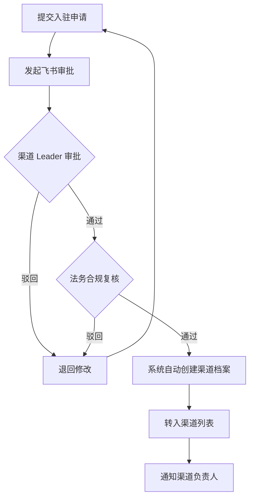

**飞书审批可查看字段**：
- 基本信息：编号、提交人、提交时间、公司全称、所在城市、公司规模、所属行业、联系方式
- 工商资质：营业执照副本（可预览/下载）
- 客户资源：初期提报客户盘点（可预览/下载）
- 审批字段：渠道审核阶段、渠道初次判断结论

---

### 4.3 渠道列表 (P0)

#### 页面入口

- **主入口**：左侧菜单"渠道列表"。
- **快捷入口**：工作台指标卡片点击跳转（自动填充筛选条件）。

#### 4.3.1 渠道列表页

##### UI 元素与展示规则

**查询区字段**：

| 字段 | 类型 | 说明 |
| --- | --- | --- |
| 渠道名称 | 文本输入 | 模糊匹配 |
| 状态 | 下拉单选 | 全部/合作中/即将到期/已解约 |
| 分佣类型 | 下拉单选 | 全部/阶梯等级/固定比例/个性化 |
| 等级 | 下拉单选 | 全部/金牌/银牌/铜牌/无（选择"无"筛选固定比例/个性化类型渠道） |
| 负责人 | 下拉单选 | 筛选特定负责人 |
| 到期时间 | 日期范围 | 选择合作截止日期范围 |
| 业绩区间 | 数字范围 | 输入累计业绩金额范围（单位：万元） |

**列表展示字段**：

| 字段 | 说明 |
| --- | --- |
| 渠道名称 | 公司全称，点击跳转详情页 |
| 状态 | 合作中（绿色）/即将到期（橙色，≤30天）/已解约（灰色） |
| 分佣类型 | 阶梯等级/固定比例/个性化 |
| 等级 | 🥇金牌 / 🥈银牌 / 🥉铜牌（仅阶梯等级类型显示）；固定比例/个性化类型显示"-" |
| 当前分佣比例 | 阶梯等级显示当前等级对应比例；固定比例显示约定比例；个性化显示"按约定" |
| 合作开始日 | 合作周期起始日期 |
| 合作截止日 | 合作周期截止日期，即将到期时红色高亮 |
| 本周期累计业绩 | 当前合作周期内的累计业绩（YTD） |
| 累计推荐客户数 | 该渠道累计报备的客户总数（含所有状态） |
| 累计成交客户数 | 该渠道累计成交的客户数（报备状态为"已转化"） |
| 最近成交时间 | 该渠道最近一次成交的时间，无成交时显示"-" |
| 负责人 | 内部渠道负责人姓名 |

**操作按钮**：

| 按钮 | 可见条件 | 点击行为 |
| --- | --- | --- |
| 查看详情 | 始终可见 | 跳转渠道详情页 |
| 续约 | 状态为"即将到期"（≤30天） | 打开续约表单，自动填充旧资料 |
| 解约 | 状态为"合作中"或"即将到期" | 发起解约流程 |

##### 操作与交互逻辑

| 操作 | 交互反馈 |
| --- | --- |
| 点击【查询】 | 刷新列表，保留筛选条件 |
| 点击【重置】 | 清空所有筛选条件，恢复默认值 |
| 从 Dashboard 跳转 | 自动填充对应筛选条件 |

##### 异常状态处理

| 场景 | 处理方式 |
| --- | --- |
| 列表为空 | 显示"暂无渠道数据，[去申请入驻]"引导操作 |
| 加载失败 | 显示"数据加载失败，[重试]" |

#### 列表页布局示意

```
┌─────────────────────────────────────────────────────────────────────────────────────────────────────────────────────┐
│  渠道列表                                                                                        [新建入驻申请]      │
├─────────────────────────────────────────────────────────────────────────────────────────────────────────────────────┤
│  查询区                                                                                                              │
│  ┌───────────────────────────────────────────────────────────────────────────────────────────────────────────────┐  │
│  │ 渠道名称：[________________]  状态：[全部 ▼]  分佣类型：[全部 ▼]  等级：[全部 ▼]                                │  │
│  │ 负责人：[全部 ▼]  到期时间：[______] 至 [______]  业绩区间：[____] - [____] 万                                 │  │
│  │                                                                                          [重置]  [查询]       │  │
│  └───────────────────────────────────────────────────────────────────────────────────────────────────────────────┘  │
├─────────────────────────────────────────────────────────────────────────────────────────────────────────────────────┤
│  列表区                                                                                      共 12 条  第 1/2 页     │
│  ┌───┬────────────┬──────┬────┬────┬────────┬────────┬────────┬────────┬────────┬────────┬──────────┬──────┬───┐  │
│  │序号│ 渠道名称    │ 状态  │等级│比例│累计业绩 │推荐客户 │成交客户 │最近成交  │开始日期 │截止日期  │ 负责人   │操作│  │
│  ├───┼────────────┼──────┼────┼────┼────────┼────────┼────────┼────────┼────────┼────────┼──────────┼──────┼───┤  │
│  │ 1 │ 成都XX科技..│合作中 │🥇金│ 12%│ 120万  │   45   │   12   │01-10   │2025-01 │2026-01 │ 张三    │ ⋮ │  │
│  │ 2 │ 杭州YY信息..│即将到期│🥈银│  8%│  85万  │   32   │    8   │01-05   │2025-03 │2026-03 │ 张三    │ ⋮ │  │
│  │ 3 │ 北京ZZ科技..│合作中 │  - │ 10%│  50万  │   28   │    5   │12-20   │2025-06 │2026-06 │ 李四    │ ⋮ │  │
│  │ 4 │ 上海AA战略..│合作中 │  - │按约定│  30万  │   15   │    2   │11-30   │2025-08 │2026-08 │ 王五    │ ⋮ │  │
│  └───┴────────────┴──────┴────┴────┴────────┴────────┴────────┴────────┴────────┴────────┴──────────┴──────┴───┘  │
│                                                                                        [< 上一页]  [下一页 >]       │
└─────────────────────────────────────────────────────────────────────────────────────────────────────────────────────┘
```


---

### 4.4 客户报备 (P0)

#### 页面入口

- **主入口**：左侧菜单"客户报备"。
- **快捷入口**：渠道详情页 → 报备管理 Tab → 右上角【新建报备】。
- **批量入口**：报备列表页【批量导入】，下载模板后填写上传。

#### 4.4.1 报备客户列表页

##### UI 元素与展示规则

**查询区字段**：

| 字段 | 类型 | 说明 |
| --- | --- | --- |
| 客户名称 | 文本输入 | 模糊匹配 |
| 报备状态 | 下拉单选 | 全部/待审批/已驳回/保护期内/已转化/已失效/已作废 |
| 跟进状态 | 下拉单选 | 全部/未跟进/跟进中/关联客户 |
| 商机阶段 | 下拉单选 | 全部/无商机/商机中/已成单 |
| 成交状态 | 下拉单选 | 全部/已签约/已回款（部分）/已回款（全部） |
| 报备时间 | 日期范围 | 起止日期选择 |
| 所属渠道 | 下拉单选 | 筛选特定渠道 |
| 渠道负责人 | 下拉单选 | 筛选特定负责人 |

**列表展示字段**：

| 分类 | 字段 | 说明 |
| --- | --- | --- |
| 报备信息 | 客户名称 | 报备时填写的客户公司全称，点击跳转详情 |
|  | 合作伙伴名称 | 报备该客户的渠道名称 |
|  | 渠道负责人 | 负责该渠道的内部人员 |
|  | 报备时间 | 报备提交时间 |
|  | 报备状态 | 待审批（橙色）/已驳回（红色）/保护期内（蓝色）/已转化（绿色）/已失效（灰色）/已作废（灰色） |
|  | 保护到期日 | 报备保护期截止日期，≤7天时红色高亮；待审批/已驳回状态时显示"-" |
| CRM 同步 | CRM 当前负责人 | 客户在 CRM 中的当前负责人 |
|  | 跟进状态 | 未跟进/跟进中/关联客户 |
|  | 商机阶段 | 无商机/商机中/已成单 |
| OMS 同步 | 成交状态 | 已签约/已回款（部分）/已回款（全部） |
|  | 签约金额 | 订单签约总金额 |
|  | 已回款金额 | 已收到的回款金额 |

**操作按钮**：

| 按钮 | 可见条件 | 点击行为 |
| --- | --- | --- |
| 查看详情 | 始终可见 | 跳转报备详情页 |
| 重新提交 | 状态为"已驳回" | 进入编辑模式，补充材料后可重新提交审批 |
| 延期申请 | 保护期到期前 7 天可见 | 弹出延期申请表单 |
| 作废 | 仅限"未跟进"状态或"已驳回"状态 | 弹出确认框，确认后释放客户 |

##### 操作与交互逻辑

| 操作 | 交互反馈 |
| --- | --- |
| 点击【查询】 | 刷新列表，保留筛选条件 |
| 点击【重置】 | 清空所有筛选条件，恢复默认值"全部" |
| 从 Dashboard 跳转 | 自动填充对应筛选条件 |
| 筛选条件变更 | URL 参数同步，支持分享带筛选的链接 |

##### 列表页布局示意

```
┌─────────────────────────────────────────────────────────────────────────────────────────┐
│  客户报备管理                                              [批量导入]  [新建报备]        │
├─────────────────────────────────────────────────────────────────────────────────────────┤
│  查询区                                                                                  │
│  ┌─────────────────────────────────────────────────────────────────────────────────┐   │
│  │ 客户名称：[________________]  报备状态：[全部 ▼]  跟进状态：[全部 ▼]              │   │
│  │ 商机阶段：[全部 ▼]  成交状态：[全部 ▼]  报备时间：[______] 至 [______]           │   │
│  │ 所属渠道：[全部 ▼]  渠道负责人：[全部 ▼]                    [重置]  [查询]        │   │
│  └─────────────────────────────────────────────────────────────────────────────────┘   │
├─────────────────────────────────────────────────────────────────────────────────────────┤
│  列表区                                                        共 156 条  第 1/16 页    │
│  ┌───┬────────────┬──────┬────────┬────────┬────────┬────────┬──────────┬────────┬───┐ │
│  │序号│ 客户名称    │报备状态│跟进状态 │商机阶段 │成交状态 │ 报备时间  │ 保护到期  │ 负责人│操作│ │
│  ├───┼────────────┼──────┼────────┼────────┼────────┼────────┼──────────┼────────┼───┤ │
│  │ 1 │ 重庆XX科技..│🟠待审批│   -     │   -    │   -    │2026-01-13│    -     │ 张三 │ ⋮ │ │
│  │ 2 │ 四川都九成..│保护期内│ 跟进中  │ 商机中  │   -    │2026-01-10│2026-04-10│ 张三 │ ⋮ │ │
│  │ 3 │ 成都米仓山..│保护期内│ 未跟进  │   -    │   -    │2026-01-08│2026-04-08│ 李四 │ ⋮ │ │
│  │ 4 │ 成都阿晋卖..│已转化  │关联客户 │ 已成单  │已签约   │2025-11-15│    -     │ 王五 │ ⋮ │ │
│  └───┴────────────┴──────┴────────┴────────┴────────┴────────┴──────────┴────────┴───┘ │
│                                                              [< 上一页]  [下一页 >]     │
└─────────────────────────────────────────────────────────────────────────────────────────┘
```

#### 4.4.2 新建报备页

##### UI 元素与展示规则

**表单字段**：

| 分类 | 字段 | 必填 | 输入限制 |
| --- | --- | --- | --- |
| 客户信息 | 客户名称 | 是 | 客户公司全称，提交时调用企查查接口校验真实性 |
|  | 省份 | 是 | 下拉选择，省市级联 |
|  | 城市 | 是 | 下拉选择，跟随省份联动 |
|  | 一级行业 | 是 | 下拉选：制造业/零售业/服务业/金融/教育/医疗/其他 |
|  | 企业规模 | 是 | 下拉选：1-50人/51-200人/201-500人/501-1000人/1000人以上 |
| 联系信息 | 联系人 | 是 | 客户方对接人姓名，最大 20 字符 |
|  | 联系人岗位 | 是 | 客户方对接人职位，最大 20 字符 |
|  | 联系电话 | 是 | 客户联系电话，手机号格式校验 |
| 报备凭证 | 报备凭证截图 | 是 | 上传渠道伙伴提供的报备表截图，**必须包含：客户名称、对接人姓名、对接人岗位、对接人联系方式**，单个文件 ≤ 10MB，支持多张 |
| 商机信息 | 预计成交金额 | 否 | 数字输入，单位：万元 |
|  | 预计成交日期 | 否 | 日期选择 |
|  | 商机描述 | 否 | 多行文本，最大 500 字符 |
|  | 对接推进截图 | 否 | 上传与客户沟通的截图、名片等，单个文件 ≤ 10MB |
| 系统字段 | 报备编号 | 自动 | 系统生成，格式：BB+年月日+4位流水号 |
|  | 报备人 | 自动 | 当前操作用户 |
|  | 报备时间 | 自动 | 系统记录提交时间 |
|  | 所属渠道 | 自动 | 自动关联当前渠道 |

> ⚠️ **重要提示**：
> - 报备凭证截图和对接推进截图必须**真实有效**
> - 后期商务核对时，若发现截图内容不符合要求或不真实，将默认为"自开拓"客户，**不发放渠道佣金**

##### 报备提交流程

> **说明**：本流程直接在客户维度与CRM系统（分销逍客）打通，不从线索开始。CRM已存在客户时走"来源更改"分支。

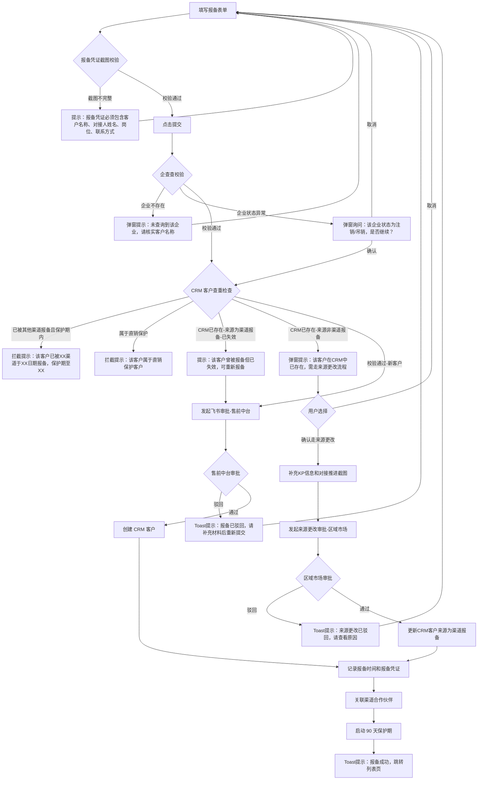

##### 操作与交互逻辑

| 操作 | 交互反馈 |
| --- | --- |
| 点击【提交】 | 按钮置灰显示 Loading，依次执行：企查查校验 → CRM撞单检查 → 发起审批 |
| 企查查校验中 | 按钮 Loading 文案："正在校验企业信息..." |
| 撞单检查中 | 按钮 Loading 文案："正在检查客户冲突..." |
| 提交成功 | Toast 提示"报备提交成功，等待审批"，自动跳转列表页 |
| 点击【取消】 | 弹出确认框"确定放弃编辑？"，确认后返回列表页 |

##### 异常状态处理

| 场景 | 处理方式 |
| --- | --- |
| 必填项未填 | 对应字段红框高亮，下方提示"请填写此字段" |
| 企查查接口超时 | Toast 提示"企业信息校验超时，请稍后重试"，按钮恢复可点击 |
| 网络异常 | Toast 提示"网络异常，请检查网络后重试" |

#### 4.4.3 报备详情页

##### 页面入口

- 列表页点击客户名称或【查看详情】。
- Dashboard 待办事项点击跳转。

##### UI 元素与展示规则

**状态卡片区**：

| 展示项 | 说明 |
| --- | --- |
| 报备状态 | 待审批（橙色）/已驳回（红色）/保护期内（蓝色）/已转化（绿色）/已失效（灰色）/已作废（灰色） |
| 保护到期 | 格式：YYYY-MM-DD（剩余 X 天），≤7天红色高亮；待审批/已驳回状态时显示"-" |
| 跟进状态 | 未跟进/跟进中/关联客户 |
| 商机阶段 | 无商机/商机中/已成单 |
| 成交状态 | 已签约/已回款（部分）/已回款（全部） |
| CRM客户状态 | 已创建/已关联（显示CRM客户ID） |

**Tab 页签**：

| Tab | 内容 |
| --- | --- |
| 基础信息 | 客户信息、联系信息、商机信息、报备信息 |
| 报备凭证 | 报备凭证截图（必须包含客户名称、对接人姓名、岗位、联系方式）、对接推进截图 |
| 工商信息 | 企查查返回的企业法人、注册资本、成立日期、企业状态、注册地址等 |
| 跟进记录 | 从 CRM 同步的跟进记录时间线 |
| 关联订单 | 从 OMS 同步的订单信息（订单号、签约金额、回款金额、状态） |

**操作按钮**：

| 按钮 | 可见条件 | 点击行为 |
| --- | --- | --- |
| 延期申请 | 保护期到期前 7 天可见 | 弹出延期申请表单 |
| 作废 | 仅限"未跟进"状态 | 弹出确认框，确认后释放客户 |
| 补充凭证 | 报备凭证不完整时 | 弹出上传表单，补充报备凭证截图 |

##### 详情页布局示意

```
┌─────────────────────────────────────────────────────────────────────────────────────────┐
│  报备详情 - 四川都九成商贸有限公司                                [延期申请]  [作废]      │
├─────────────────────────────────────────────────────────────────────────────────────────┤
│  ┌─────────────────────────────────────────────────────────────────────────────────┐   │
│  │ 报备状态卡片                                                                      │   │
│  │ ────────────────────────────────────────────────────────────────────────────── │   │
│  │ 报备状态：🟢 保护期内          跟进状态：跟进中           商机阶段：商机中         │   │
│  │ 保护到期：2026-04-10（剩余87天）                          成交状态：-             │   │
│  └─────────────────────────────────────────────────────────────────────────────────┘   │
├─────────────────────────────────────────────────────────────────────────────────────────┤
│  [基础信息]  [工商信息]  [跟进记录]  [关联订单]                                          │
├─────────────────────────────────────────────────────────────────────────────────────────┤
│  基础信息                                                                                │
│  ┌─────────────────────────────┐  ┌─────────────────────────────┐                      │
│  │ 客户名称：四川都九成商贸有限公司│  │ 联系人：李猛                  │                      │
│  │ 所在地区：四川省 - 成都市      │  │ 联系电话：138****1234        │                      │
│  │ 一级行业：零售业              │  │ 企业规模：51-200人           │                      │
│  │ 报备渠道：成都XX科技有限公司   │  │ 渠道负责人：张三              │                      │
│  │ 报备时间：2026-01-10 14:30   │  │ 报备编号：BB20260110001     │                      │
│  └─────────────────────────────┘  └─────────────────────────────┘                      │
│  商机信息                                                                                │
│  ┌─────────────────────────────────────────────────────────────────────────────────┐   │
│  │ 预计成交金额：50万            预计成交日期：2026-03-31                             │   │
│  │ 商机描述：客户有明确的RPA采购需求，计划在Q1完成采购...                               │   │
│  │ 拓展佐证：[查看附件]                                                              │   │
│  └─────────────────────────────────────────────────────────────────────────────────┘   │
└─────────────────────────────────────────────────────────────────────────────────────────┘
```

#### 4.4.4 客户来源更改（新建报备流程分支）

> **说明**：来源更改不是独立入口，而是**新建报备流程**中的一个分支。当渠道负责人新建报备时，如果CRM查重发现客户已存在且来源非"渠道报备"，则自动进入来源更改流程。

##### 触发条件

在新建报备流程中，CRM客户查重检查结果为：
- 客户在CRM中已存在
- 客户来源**不是**"渠道报备"（如：自开拓、市场活动、官网等）

##### 额外补充字段

在标准报备表单基础上，来源更改流程需额外补充：

| 字段 | 必填 | 输入限制 |
| --- | --- | --- |
| 有效KP信息 | 是 | 关键决策人信息（姓名、职位、联系方式），证明渠道掌握有效KP |
| 对接推进截图 | 是 | 上传有效的对接推进过程截图，证明渠道确有实质推进 |
| 变更说明 | 是 | 详细说明为何该客户应归属渠道，最大 500 字符 |

##### 审批差异

| 对比项 | 标准新建报备 | 来源更改分支 |
| --- | --- | --- |
| 审批人 | 售前中台 | 区域市场同学 |
| 抄送 | 无 | 抄送主管和区总 |
| 审批重点 | 客户真实性、防撞单 | 报备材料真实性、KP有效性、推进过程真实性 |
| CRM操作 | 创建新客户 | 更新已有客户来源 |

> ⚠️ **重要说明**：
> - 来源更改申请需提供**明确的报备截图、有效KP、有效对接推进过程**
> - 若发现截图内容不符合要求或不真实，将默认为"自开拓"客户，**不发放渠道佣金**

---

#### 4.4.5 报备保护机制

| 规则 | 说明 |
| --- | --- |
| 自动判重 | 提交时系统自动检索，客户已被其他渠道锁定或属直销保护则直接拦截 |
| 保护期 | 审批通过后给予 **90 天** 保护期 |
| 延期申请 | 到期前 7 天可申请延期，需售前中台审批 |
| 自动失效 | 保护期到期且未转化/未延期，状态自动变更为"已失效" |
| 自动转化 | 当 OMS 产生关联订单且完成签约，状态自动变更为"已转化" |
| 凭证核验 | 后期商务核对报备凭证，不符合要求或不真实则视为"自开拓"，不发放佣金 |

#### 4.4.6 客户跟进状态同步

> **说明**：本系统直接在客户维度与CRM系统（分销逍客）打通，实时同步客户状态。

**状态同步来源**：

| 状态类型 | 来源 | 枚举值 |
| --- | --- | --- |
| CRM客户状态 | CRM | 已创建 / 已关联 |
| 跟进状态 | CRM | 未跟进 / 跟进中 / 已跟进 |
| 商机阶段 | CRM | 无商机 / 商机中 / 已成单 |
| 成交状态 | OMS | 已签约 / 已回款（部分） / 已回款（全部） |

**同步频率**：
- 增量同步：每 15 分钟同步最近变更数据。
- 全量同步：每日凌晨 2:00 全量比对。

**CRM客户关联说明**：
- **新客户报备**：售前中台审批通过后，系统自动在CRM中创建客户，来源标记为"渠道报备"
- **来源更改（CRM已存在客户）**：区域市场审批通过后，系统更新已有客户的来源为"渠道报备"

---

### 4.5 业绩管理 & 月度结算 (P0)

#### 页面入口

- **主入口**：左侧菜单"业绩管理"。
- **快捷入口**：工作台待办事项"月度结算待核对"点击跳转。

#### 4.5.1 月度结算单

##### 生成规则

- 每月初（T+1）自动生成上月结算单。
- 包含：系统抓取的成交订单 + 归属于上月的调账记录。

##### 结算单状态流转

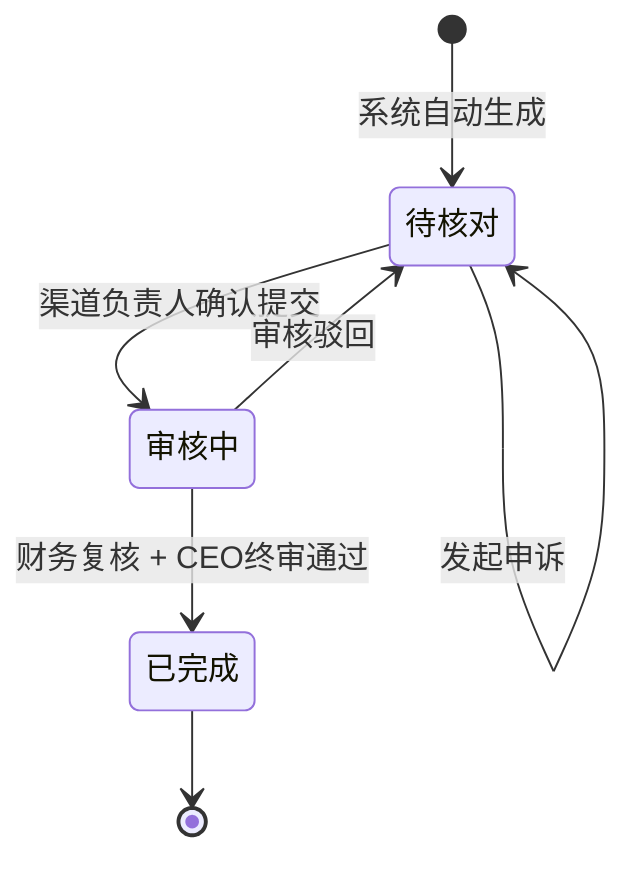

##### 结算单详情字段

| 字段 | 说明 |
| --- | --- |
| 结算单号 | 系统自动生成 |
| 结算周期 | 所属年月（如：2025年12月） |
| 渠道名称 | 对应渠道 |
| 分佣类型 | 阶梯等级/固定比例/个性化 |
| 当前等级 | 阶梯等级类型显示当前等级（铜/银/金）；其他类型显示"-" |
| 成交订单数 | 本月关联订单数量 |
| 成交金额 | 本月订单总金额 |
| 分佣比例 | 阶梯等级：当前等级对应比例；固定比例：约定比例；个性化：显示"按约定" |
| 应发金额 | 计算后的分佣金额（成交金额 × 分佣比例） |
| 调账金额 | 正负调账合计 |
| 实发金额 | 应发金额 + 调账金额 |
| 状态 | 待核对/审核中/已完成 |

> **分佣计算说明**：
> - **阶梯等级**：根据结算时的累计业绩判定等级，使用对应等级的分佣比例计算
> - **固定比例**：使用入驻时约定的固定比例计算
> - **个性化**：需人工按约定规则单独核算，系统仅记录

#### 4.5.2 渠道订单核对页面

> **说明**：渠道订单核对是月度结算的核心环节，需要销售和渠道双方分别确认订单数据的准确性。

##### 页面入口

- **主入口**：左侧菜单"业绩管理" → "渠道订单核对"
- **销售专属入口**：系统生成专属核对链接，销售可直接访问核对自己相关的订单
- **快捷入口**：工作台待办事项"待核对订单"点击跳转

##### 页面布局

页面分为三个核心区域：

```
┌─────────────────────────────────────────────────────────────────────────────────────────────────────┐
│  渠道订单核对                                            结算周期：[2025年12月 ▼]  [导出核对清单]   │
├─────────────────────────────────────────────────────────────────────────────────────────────────────┤
│  ┌─────────────────────────────────────────────────────────────────────────────────────────────┐   │
│  │ 📊 核对进度概览                                                                              │   │
│  │ ┌──────────────┐ ┌──────────────┐ ┌──────────────┐ ┌──────────────┐ ┌──────────────┐        │   │
│  │ │  待核对订单   │ │  销售已确认   │ │  渠道已确认   │ │  双方确认通过  │ │  需人工处理   │        │   │
│  │ │     15      │ │     32      │ │     28      │ │     25      │ │      3      │        │   │
│  │ └──────────────┘ └──────────────┘ └──────────────┘ └──────────────┘ └──────────────┘        │   │
│  └─────────────────────────────────────────────────────────────────────────────────────────────┘   │
├─────────────────────────────────────────────────────────────────────────────────────────────────────┤
│  [全部订单]  [待销售确认]  [待渠道确认]  [双方已确认]  [需人工处理]                                   │
├─────────────────────────────────────────────────────────────────────────────────────────────────────┤
│  查询区                                                                                             │
│  渠道名称：[________]  销售：[全部 ▼]  核对状态：[全部 ▼]  回款日期：[______] 至 [______]  [查询]   │
├─────────────────────────────────────────────────────────────────────────────────────────────────────┤
│  订单列表                                                              [批量确认]  [导入渠道确认]   │
│  ┌─────────────────────────────────────────────────────────────────────────────────────────────┐   │
│  │ □ 渠道名称      客户名称      合同编号    订单编号   订单产品   订单金额  回款日期  回款金额  销售确认 渠道确认 操作│   │
│  ├─────────────────────────────────────────────────────────────────────────────────────────────┤   │
│  │ □ 成都飞逸计算机 四川XX有限公司 HT202512001 DD001    影刀标准版  39,800   12-05    39,800   ✅已确认 ✅已确认  ⋮ │   │
│  │ □ 成都四方创享.. 重庆YY商贸.. HT202512002 DD002    影刀专业版  59,800   12-11    59,800   ✅已确认 ⏳待确认  ⋮ │   │
│  │ □ 成都有为谷网络 贵州ZZ科技.. HT202512003 DD003    影刀企业版  59,800   12-19    59,800   ⏳待确认 ⏳待确认  ⋮ │   │
│  │ □ 西安胖柴信息.. 陕西AA企业.. HT202512004 DD004    影刀标准版  59,800   12-30    59,800   ❌有异议 ✅已确认  ⋮ │   │
│  └─────────────────────────────────────────────────────────────────────────────────────────────┘   │
│                                                                          [< 上一页]  [下一页 >]     │
└─────────────────────────────────────────────────────────────────────────────────────────────────────┘
```

##### 订单列表字段

| 字段 | 说明 |
| --- | --- |
| 渠道名称 | 推荐该订单的渠道合作伙伴名称 |
| 客户名称 | 成交客户公司名称 |
| 合同编号 | 签约合同的编号 |
| 订单编号 | OMS 系统中的订单编号 |
| 订单产品名称 | 订单中的产品名称，包括：实施(内部)、AP账号、RPA公有云高级账号、私有云控制台 |
| 订单金额 | 订单总金额 |
| 回款日期 | 回款到账日期 |
| 周期回款金额 | 当期回款金额 |
| 渠道比例 | 适用的分佣比例 |
| 渠道佣金 | 计算后的佣金金额 |
| 销售确认 | ⏳待确认 / ✅已确认 / ❌有异议 |
| 渠道确认 | ⏳待确认 / ✅已确认 / ❌有异议 |
| 核对状态 | 待核对/销售已确认/渠道已确认/双方确认通过/需人工处理 |
| 负责销售 | 负责该渠道的销售人员 |

##### 核对状态说明

| 状态 | 触发条件 | 后续操作 |
| --- | --- | --- |
| **待核对** | 订单刚导入，双方均未确认 | 等待销售和渠道确认 |
| **销售已确认** | 销售点击"确认无误" | 等待渠道确认 |
| **渠道已确认** | 渠道确认结果已导入 | 等待销售确认 |
| **双方确认通过** | 销售确认+渠道确认均为"无误" | 自动通过，进入结算 |
| **需人工处理** | 任一方标记"有异议" | 渠道负责人人工处理 |

---

#### 4.5.3 销售订单核对页面 (P0)

> **说明**：销售订单核对是一个独立页面，供销售人员确认某个月份与自己相关的渠道订单信息。页面展示订单的业绩和提成计算明细，销售需逐一确认订单信息的准确性。

##### 页面入口

| 入口方式 | 说明 |
| --- | --- |
| **主入口** | 左侧菜单"业绩管理" → "销售订单核对" |
| **飞书通知链接** | 每月初系统自动发送核对通知，包含专属链接 |
| **工作台待办** | 点击"待核对订单"跳转，自动筛选当前销售的订单 |

##### 页面布局

```
┌─────────────────────────────────────────────────────────────────────────────────────────────────────────────────┐
│  销售订单核对                                                                   结算周期：[2026年01月 ▼]        │
├─────────────────────────────────────────────────────────────────────────────────────────────────────────────────┤
│  ┌─────────────────────────────────────────────────────────────────────────────────────────────────────────┐   │
│  │ 📊 本月核对汇总                                                                                          │   │
│  │ ┌──────────────┐ ┌──────────────┐ ┌──────────────┐ ┌──────────────┐ ┌──────────────┐ ┌──────────────┐   │   │
│  │ │   待核对      │ │   已确认      │ │   有异议      │ │  订单总额     │ │  计入业绩     │ │  计入提成     │   │   │
│  │ │     5 单     │ │    12 单     │ │     1 单     │ │  58.8 万     │ │  48.8 万     │ │  5.88 万     │   │   │
│  │ └──────────────┘ └──────────────┘ └──────────────┘ └──────────────┘ └──────────────┘ └──────────────┘   │   │
│  └─────────────────────────────────────────────────────────────────────────────────────────────────────────┘   │
├─────────────────────────────────────────────────────────────────────────────────────────────────────────────────┤
│  ⚠️ 请核对以下订单信息，确认无误后点击"确认"，如有异议请点击"异议"并填写原因                                      │
├─────────────────────────────────────────────────────────────────────────────────────────────────────────────────┤
│  [全部 18]  [待核对 5]  [已确认 12]  [有异议 1]                                           [一键全部确认]        │
├─────────────────────────────────────────────────────────────────────────────────────────────────────────────────┤
│  查询区                                                                                                         │
│  渠道名称：[________]  客户名称：[________]  计算类型：[全部 ▼]  核对状态：[全部 ▼]           [查询]  [重置]     │
├─────────────────────────────────────────────────────────────────────────────────────────────────────────────────┤
│  订单列表                                                                                  共 18 条  第 1/2 页  │
│  ┌─────────────────────────────────────────────────────────────────────────────────────────────────────────┐   │
│  │ □ 序号 渠道名称      客户名称      订单编号     订单金额   周期回款金额   商品名称   核对状态  操作       │   │
│  ├─────────────────────────────────────────────────────────────────────────────────────────────────────────┤   │
│  │ □  1  成都XX科技    四川都九成..  DD202601001  100,000    100,000     AP账号    ⏳待核对  [操作]      │   │
│  │ □  2  成都XX科技    重庆YY商贸..  DD202601002   50,000     20,000     实施(内部) ⏳待核对  [操作]      │   │
│  │ □  3  杭州YY信息    杭州ZZ科技..  DD202601003   80,000     80,000     AP账号    ✅已确认  [操作]      │   │
│  │ □  4  北京ZZ科技    北京AA企业..  DD202601004   60,000     60,000     AP账号    ❌有异议  [操作]      │   │
│  └─────────────────────────────────────────────────────────────────────────────────────────────────────────┘   │
│                                                                                      [< 上一页]  [下一页 >]     │
└─────────────────────────────────────────────────────────────────────────────────────────────────────────────────┘
```

##### 订单列表字段说明

| 分类 | 字段 | 说明 |
| --- | --- | --- |
| 订单信息 | 渠道名称 | 推荐该订单的渠道合作伙伴名称 |
|  | 客户名称 | 成交客户公司名称 |
|  | 合同编号 | 签约合同的编号 |
|  | 订单编号 | OMS 系统中的订单编号 |
|  | 商品名称 | 实施(内部)、AP账号、RPA公有云高级账号、私有云控制台 |
|  | 订单金额 | 订单总金额 |
|  | 回款日期 | 回款到账日期 |
|  | 周期回款金额 | 当期回款金额 |
| 核对信息 | 核对状态 | ⏳待核对 / ✅已确认 / ❌有异议 |
|  | 异议原因 | 如有异议，显示填写的原因 |

##### 订单详情弹窗

点击订单行或【查看详情】按钮，弹出订单详情：

```
┌─────────────────────────────────────────────────────────────────────────────────────────┐
│  订单详情                                                                      [✕ 关闭] │
├─────────────────────────────────────────────────────────────────────────────────────────┤
│  订单基本信息                                                                            │
│  ┌─────────────────────────────────────────────────────────────────────────────────┐   │
│  │ 订单编号：DD202601002                    合同编号：HT202601002                    │   │
│  │ 渠道名称：成都XX科技有限公司               客户名称：重庆YY商贸有限公司              │   │
│  │ 订单产品：影刀RPA专业版                   订单金额：50,000.00 元                   │   │
│  │ 回款日期：2026-01-15                     回款金额：50,000.00 元                   │   │
│  └─────────────────────────────────────────────────────────────────────────────────┘   │
├─────────────────────────────────────────────────────────────────────────────────────────┤
│  业绩与提成计算                                                         🏷️ 仅计提成     │
│  ┌─────────────────────────────────────────────────────────────────────────────────┐   │
│  │ 计算类型：仅计提成                        调整单号：TZ202601003                    │   │
│  │ ──────────────────────────────────────────────────────────────────────────────  │   │
│  │ 订单金额：            50,000.00 元                                               │   │
│  │ 计入业绩：                 0.00 元       ← 不计入渠道业绩累计                      │   │
│  │ 分佣比例：                   15%         ← 按调账约定比例                         │   │
│  │ 计入提成：             7,500.00 元       ← 计入本月结算单                         │   │
│  │ ──────────────────────────────────────────────────────────────────────────────  │   │
│  │ 调整原因：特殊合作协议 - 该订单为战略合作项目转介绍，按协议约定不计入业绩累计         │   │
│  └─────────────────────────────────────────────────────────────────────────────────┘   │
├─────────────────────────────────────────────────────────────────────────────────────────┤
│  核对操作                                                                                │
│  ┌─────────────────────────────────────────────────────────────────────────────────┐   │
│  │ 当前状态：⏳ 待核对                                                               │   │
│  │                                                                                   │   │
│  │                                          [确认无误 ✓]    [有异议 ✗]               │   │
│  └─────────────────────────────────────────────────────────────────────────────────┘   │
└─────────────────────────────────────────────────────────────────────────────────────────┘
```

##### 核对操作与交互

| 操作 | 交互反馈 |
| --- | --- |
| 点击【确认无误】 | 该订单核对状态变更为"✅已确认"，汇总数据刷新 |
| 点击【有异议】 | 弹出异议表单，填写异议原因，状态变更为"❌有异议" |
| 点击【一键全部确认】 | 弹出确认框"确认全部待核对订单无误？"，确认后批量更新状态 |
| 勾选多条 + 批量确认 | 仅对选中的订单进行批量确认 |
| 核对完成 | Toast 提示"核对完成，共确认 X 条订单" |
| 切换结算周期 | 刷新列表和汇总数据，加载对应月份的订单 |

##### 异议处理流程

```mermaid
flowchart TD
    A[销售点击有异议] --> B[弹出异议表单]
    B --> C[选择异议类型]
    C --> D[填写异议说明]
    D --> E[提交异议]
    E --> F[订单状态变更为"有异议"]
    F --> G[通知渠道负责人处理]
    G --> H{渠道负责人核实}
    H -->|确认销售异议合理| I[修正订单数据]
    I --> J[订单重新进入待核对]
    H -->|确认订单无误| K[与销售沟通解释]
    K --> L[销售重新确认]
```

**异议类型选项**：

| 异议类型 | 说明 |
| --- | --- |
| 订单金额有误 | 订单金额与实际签约金额不符 |
| 回款金额有误 | 回款金额与实际到账金额不符 |
| 渠道归属有误 | 该订单不应归属于该渠道 |
| 计算类型有误 | 应为"正常计算"或应为"仅计提成" |
| 分佣比例有误 | 适用的分佣比例不正确 |
| 其他 | 其他异议，需详细说明 |

##### 汇总统计说明

| 指标 | 计算口径 |
| --- | --- |
| 待核对 | 核对状态为"待核对"的订单数量 |
| 已确认 | 核对状态为"已确认"的订单数量 |
| 有异议 | 核对状态为"有异议"的订单数量 |
| 订单总额 | 当月所有订单的订单金额合计 |
| 计入业绩 | 当月所有订单中"计入业绩"金额的合计（仅计提成订单为0） |
| 计入提成 | 当月所有订单中"计入提成"金额的合计 |

##### 数据权限说明

| 角色 | 可见数据范围 |
| --- | --- |
| 销售 | 仅可见自己负责的渠道关联的订单 |
| 渠道负责人 | 可见自己负责的所有渠道的订单 |
| 渠道 Leader | 可见团队所有成员负责的渠道订单 |
| 管理员 | 可见全部渠道订单 |

---

#### 4.5.4 渠道订单核对（线下流程）

> **说明**：由于渠道暂无法登录系统，采用"导出-线下确认-导入"的方式完成渠道核对。

##### 导出核对清单

**操作入口**：渠道订单核对页面 → 【导出核对清单】

**导出规则**：
- 按渠道分组导出，每个渠道生成一份核对清单
- 支持选择导出全部或指定渠道
- 导出格式：Excel 文件

**导出字段**：

| 字段 | 说明 |
| --- | --- |
| 序号 | 行号 |
| 合同编号 | 签约合同编号 |
| 订单编号 | OMS 订单编号 |
| 客户名称 | 成交客户名称 |
| 订单产品名称 | 产品名称 |
| 订单金额 | 订单总金额 |
| 回款日期 | 回款到账日期 |
| 回款金额 | 实际回款金额 |
| 渠道比例 | 分佣比例 |
| 渠道佣金 | 计算后的佣金 |
| 渠道确认结果 | 【待填写】无误 / 有异议 |
| 异议说明 | 【待填写】如有异议请填写原因 |

**导出文件命名**：`渠道核对清单_[渠道名称]_[结算周期].xlsx`

##### 线下确认流程

```mermaid
flowchart TD
    A[渠道负责人导出核对清单] --> B[发送给渠道伙伴]
    B --> C[渠道伙伴核对订单明细]
    C --> D{核对结果}
    D -->|全部无误| E[在"渠道确认结果"列填写"无误"]
    D -->|有异议| F[填写"有异议"并说明原因]
    E --> G[回传核对清单给渠道负责人]
    F --> G
    G --> H[渠道负责人导入系统]
```

##### 导入渠道确认

**操作入口**：渠道订单核对页面 → 【导入渠道确认】

**导入规则**：
- 仅导入"渠道确认结果"和"异议说明"两列
- 根据订单编号匹配更新
- 支持批量导入多个渠道的确认结果

**导入校验**：

| 校验项 | 规则 |
| --- | --- |
| 订单编号匹配 | 订单编号必须存在于当前结算周期 |
| 确认结果格式 | 必须为"无误"或"有异议" |
| 异议说明 | 确认结果为"有异议"时，异议说明必填 |

**导入结果**：
- 导入成功：Toast 提示"成功导入 X 条确认结果"
- 部分失败：弹窗显示失败明细，支持下载失败记录

---

#### 4.5.5 订单核对状态流转与自动处理

##### 状态流转规则

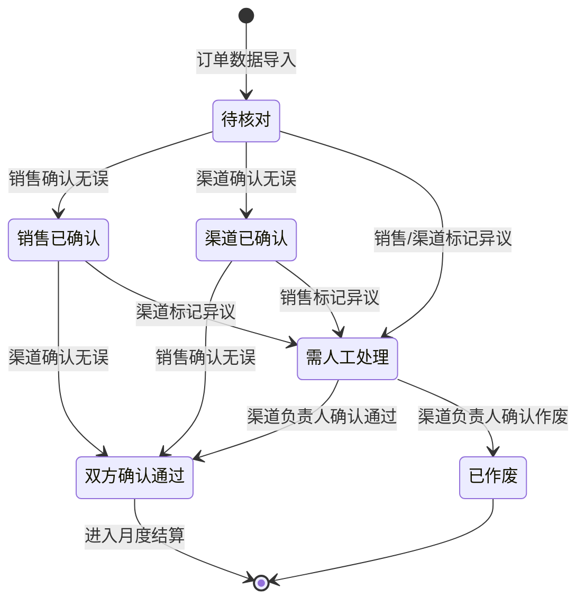

##### 自动处理规则

| 场景 | 处理方式 |
| --- | --- |
| 销售确认"无误" + 渠道确认"无误" | 系统自动将订单状态更新为"双方确认通过"，进入结算流程 |
| 销售确认"无误" + 渠道确认"有异议" | 状态变更为"需人工处理"，通知渠道负责人 |
| 销售确认"有异议" + 渠道确认"无误" | 状态变更为"需人工处理"，通知渠道负责人 |
| 销售确认"有异议" + 渠道确认"有异议" | 状态变更为"需人工处理"，通知渠道负责人 |

##### 人工处理流程

渠道负责人处理"需人工处理"状态的订单：

| 操作 | 说明 |
| --- | --- |
| 查看异议 | 查看销售/渠道填写的异议原因 |
| 确认通过 | 核实后确认订单无误，状态变更为"双方确认通过" |
| 确认作废 | 确认订单不应计入结算，状态变更为"已作废" |
| 修正数据 | 如金额有误，修正后重新发起核对 |

---

#### 4.5.6 订单核对完整流程

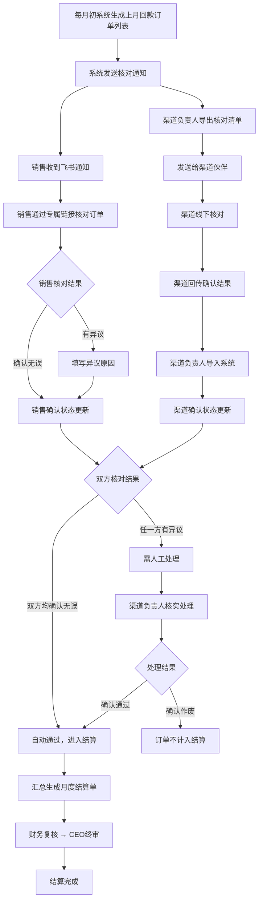

---

#### 4.5.7 调账管理页面

##### 页面入口

- **主入口**：左侧菜单"业绩管理" → "调账管理"
- **快捷入口**：渠道详情页 → 业绩账单 Tab → 【发起调账】

##### 页面布局

```
┌─────────────────────────────────────────────────────────────────────────────────────────────────────┐
│  调账管理                                                                      [新建调账]           │
├─────────────────────────────────────────────────────────────────────────────────────────────────────┤
│  查询区                                                                                             │
│  渠道名称：[________]  调账类型：[全部 ▼]  状态：[全部 ▼]  归属账期：[______]  [查询]  [重置]       │
├─────────────────────────────────────────────────────────────────────────────────────────────────────┤
│  [全部]  [业绩额调账]  [分佣额调账]  [订单级调整]                                                    │
├─────────────────────────────────────────────────────────────────────────────────────────────────────┤
│  调账列表                                                                    共 25 条  第 1/3 页    │
│  ┌─────────────────────────────────────────────────────────────────────────────────────────────┐   │
│  │ 调账单号      渠道名称      调账类型      调账金额    归属账期   状态    申请人   申请时间   操作│   │
│  ├─────────────────────────────────────────────────────────────────────────────────────────────┤   │
│  │ TZ202601001  成都XX科技    业绩额调账    +50,000    2026-01   已通过   张三    01-10      ⋮ │   │
│  │ TZ202601002  杭州YY信息    分佣额调账    +10,000    2026-01   审批中   张三    01-11      ⋮ │   │
│  │ TZ202601003  成都XX科技    订单级调整    仅计提成    2026-01   已通过   李四    01-12      ⋮ │   │
│  │ TZ202601004  北京ZZ科技    分佣额调账    -5,000     2026-01   已驳回   王五    01-13      ⋮ │   │
│  └─────────────────────────────────────────────────────────────────────────────────────────────┘   │
│                                                                          [< 上一页]  [下一页 >]     │
└─────────────────────────────────────────────────────────────────────────────────────────────────────┘
```

##### 调账列表字段

| 字段 | 说明 |
| --- | --- |
| 调账单号 | 系统自动生成，格式：TZ+年月日+3位流水号 |
| 渠道名称 | 调账关联的渠道 |
| 调账类型 | 业绩额调账/分佣额调账/订单级调整 |
| 调账金额 | 业绩额调账/分佣额调账显示金额；订单级调整显示"仅计提成" |
| 关联订单 | 订单级调整时显示关联的订单编号 |
| 归属账期 | 调账归属的结算周期（年-月） |
| 状态 | 待审批（橙色）/审批中（蓝色）/已通过（绿色）/已驳回（红色） |
| 申请人 | 发起调账的人员 |
| 申请时间 | 调账申请时间 |

##### 新建调账表单

**调账类型选择**：

| 调账类型 | 适用场景 | 必填字段 |
| --- | --- | --- |
| 业绩额调账 | 冲等级、补录存量业务 | 渠道、调账金额（+/-）、归属账期、生效时间、调账原因 |
| 分佣额调账 | 发奖金、扣罚款 | 渠道、调账金额（+/-）、归属账期、调账原因 |
| 订单级调整 | 特殊规则订单灵活性配置 | 渠道、关联订单、业绩计算模式、提成计算模式、归属账期、调整原因 |

**订单级调整表单字段**：

| 字段 | 必填 | 说明 |
| --- | --- | --- |
| 调账类型 | 是 | 选择"订单级调整" |
| 所属渠道 | 是 | 下拉选择渠道 |
| 关联订单 | 是 | 选择该渠道关联的订单（支持多选） |
| 业绩模式 | 是 | 单选：计入业绩 / 不计入业绩 |
| 提成模式 | 是 | 单选：标准计算 / 自定义比例 / 不计提成 |
| 提成比例 | 条件必填 | 提成模式为"自定义比例"时必填，输入百分比 |
| 归属账期 | 是 | 选择结算归属的年月 |
| 调整原因 | 是 | 下拉选：特殊合作协议/计算规则差异/渠道参与度低/非标项目折算/其他 |
| 原因说明 | 是 | 详细说明调整原因，最大 500 字符 |
| 附件 | 否 | 上传相关证明材料 |

##### 订单级调整详情展示

```
┌─────────────────────────────────────────────────────────────────────────────────────────┐
│  调账详情 - TZ202601003                                                                  │
├─────────────────────────────────────────────────────────────────────────────────────────┤
│  ┌─────────────────────────────────────────────────────────────────────────────────┐   │
│  │ 状态卡片                                                                          │   │
│  │ ────────────────────────────────────────────────────────────────────────────── │   │
│  │ 调账类型：订单级调整          状态：✅ 已通过          审批时间：2026-01-12 15:30 │   │
│  └─────────────────────────────────────────────────────────────────────────────────┘   │
├─────────────────────────────────────────────────────────────────────────────────────────┤
│  基本信息                                                                                │
│  ┌─────────────────────────────────────────────────────────────────────────────────┐   │
│  │ 调账单号：TZ202601003                    所属渠道：成都XX科技有限公司              │   │
│  │ 调整方式：仅计提成，不计业绩              提成比例：15%                            │   │
│  │ 归属账期：2026年01月                     申请人：李四                             │   │
│  │ 调整原因：特殊合作协议                                                            │   │
│  │ 原因说明：该订单为战略合作项目转介绍，按协议约定不计入业绩累计，但按15%比例发放提成 │   │
│  └─────────────────────────────────────────────────────────────────────────────────┘   │
├─────────────────────────────────────────────────────────────────────────────────────────┤
│  关联订单明细                                                                            │
│  ┌─────────────────────────────────────────────────────────────────────────────────┐   │
│  │ 订单编号        客户名称              订单金额      计入业绩    计入提成          │   │
│  ├─────────────────────────────────────────────────────────────────────────────────┤   │
│  │ DD20260110001  四川XX商贸有限公司      100,000      ❌ 不计入   ✅ 15,000 元      │   │
│  └─────────────────────────────────────────────────────────────────────────────────┘   │
├─────────────────────────────────────────────────────────────────────────────────────────┤
│  计算影响说明                                                                            │
│  ┌─────────────────────────────────────────────────────────────────────────────────┐   │
│  │ 📊 对业绩的影响：该订单金额 100,000 元不计入渠道"本周期累计业绩"，不影响等级判定  │   │
│  │ 💰 对提成的影响：按约定比例 15% 计算提成 15,000 元，计入 2026年01月 结算单        │   │
│  └─────────────────────────────────────────────────────────────────────────────────┘   │
└─────────────────────────────────────────────────────────────────────────────────────────┘
```

##### 操作与交互逻辑

| 操作 | 交互反馈 |
| --- | --- |
| 点击【新建调账】 | 弹出调账类型选择，选择后进入对应表单 |
| 选择"订单级调整" | 展示订单选择列表，可筛选渠道关联的订单 |
| 点击【提交】 | 校验必填项，提交审批，Toast 提示"调账申请已提交，等待审批" |
| 审批通过 | 订单标记为"仅计提成"，月度结算时自动按约定规则计算 |

---

### 4.6 渠道解约 (P0)

#### 页面入口

- **主入口**：渠道列表 → 操作列【解约】。
- **权限限制**：仅状态为"合作中"或"即将到期"的渠道可发起。

#### 解约前置检查

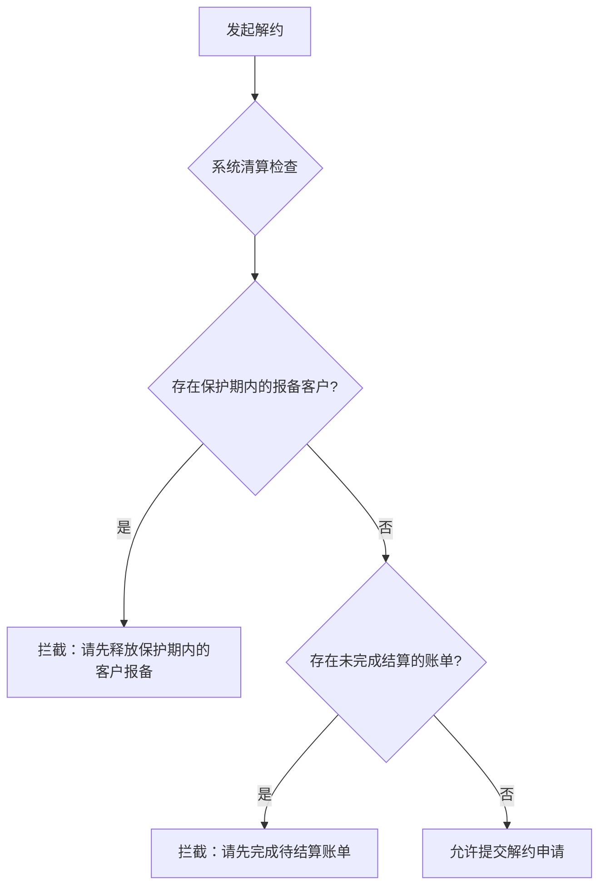

#### 解约表单字段

| 字段 | 必填 | 说明 |
| --- | --- | --- |
| 解约原因 | 是 | 下拉选：合作到期/业绩不达标/渠道主动退出/违规处理/其他 |
| 解约说明 | 是 | 详细说明解约原因 |
| 解约协议/沟通确认截图 | 是 | 上传附件，单个文件 ≤ 20MB |

#### 解约审批流程


#### 操作与交互逻辑

| 操作 | 交互反馈 |
| --- | --- |
| 点击【解约】 | 触发清算检查，通过后弹出解约表单 |
| 清算检查未通过 | 弹窗提示具体未通过项，引导处理 |
| 提交解约申请 | Toast 提示"解约申请已提交，等待审批" |
| 审批通过 | Toast 提示"解约已生效"，列表状态变更为"已解约" |

---

## 5. 关键业务机制

### 5.1 分佣规则与等级判定

#### 5.1.1 分佣类型

渠道入驻时需选择分佣类型，决定后续的分佣计算和等级判定方式：

| 分佣类型 | 等级判定 | 分佣比例来源 | 适用场景 |
| --- | --- | --- | --- |
| **阶梯等级**（默认） | ✅ 根据累计业绩自动判定（铜→银→金） | 系统固定阶梯规则 | 标准渠道，激励业绩增长 |
| **固定比例** | ❌ 无等级，显示"-" | 入驻时约定的固定比例 | 特殊合作渠道，不参与等级体系 |
| **个性化** | ❌ 无等级，显示"-" | 按个性化说明单独核算 | 战略伙伴，需特殊约定 |

#### 5.1.2 阶梯等级规则（系统固定）

系统采用固定的三级阶梯分佣规则，根据渠道**本周期累计业绩**自动判定等级和分佣比例：

| 等级 | 业绩门槛（本周期累计） | 分佣比例 |
| --- | --- | --- |
| 🥉铜牌 | 0 - 10万 | 5% |
| 🥈银牌 | 10万 - 50万 | 8% |
| 🥇金牌 | 50万以上 | 12% |

#### 5.1.3 等级升降规则

| 规则 | 说明 |
| --- | --- |
| **即时升级** | 累计业绩达到上一等级门槛时，等级**即时生效**，当月结算按新等级比例计算 |
| **只升不降** | 周期内等级只升不降，即使业绩调减也不会降级 |
| **周期重置** | 年度周期结束后业绩清零，等级重新从铜牌开始计算 |

#### 5.1.4 分佣计算示例

**场景**：某渠道为"阶梯等级"类型，本月新增成交 20 万，累计业绩从 8 万升至 28 万。

| 计算项 | 结果 |
| --- | --- |
| 月初等级 | 🥉铜牌（累计 8 万） |
| 月末等级 | 🥈银牌（累计 28 万，超过 10 万门槛） |
| 适用比例 | 8%（按月末等级计算） |
| 本月分佣 | 20 万 × 8% = 1.6 万 |

---

### 5.2 业绩与提成的核心概念

> **重要说明**：系统中每个渠道默认计算两部分核心数据——**业绩**和**提成**，二者具有明确的区别和关联关系。

#### 5.2.1 概念定义

| 概念 | 定义 | 作用 | 数据特性 |
| --- | --- | --- | --- |
| **业绩** | 订单金额的累计值 | 用于渠道等级判定（阶梯等级类型） | 可累积，周期内只增不减，周期结束清零 |
| **提成** | 根据业绩和分佣比例计算的实际发放金额 | 用于月度结算发放佣金 | 按月计算，不累积 |

#### 5.2.2 正常计算流程

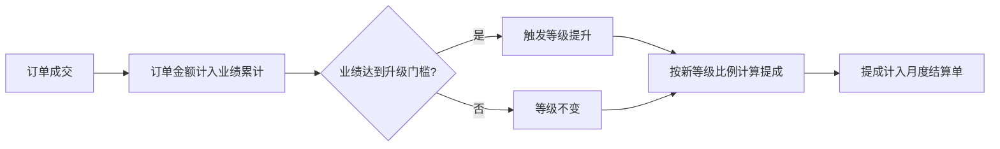

#### 5.2.3 计算示例

| 场景 | 订单金额 | 计入业绩 | 计入提成 | 说明 |
| --- | --- | --- | --- | --- |
| 正常订单 | 10万 | ✅ 10万 | ✅ 10万 × 分佣比例 | 标准流程 |
| 仅计提成订单 | 10万 | ❌ 0 | ✅ 10万 × 分佣比例 | 不影响等级，但发放佣金 |
| 业绩额调账 | +5万 | ✅ +5万 | ❌ 0 | 仅冲等级，不直接发钱 |
| 分佣额调账 | +1万 | ❌ 0 | ✅ +1万 | 直接发钱，不影响等级 |

---

### 5.3 调账机制

系统支持三种维度的调账，需明确归属账期：

#### 5.3.1 调账类型总览

| 调账类型 | 场景 | 对业绩的影响 | 对提成的影响 |
| --- | --- | --- | --- |
| **业绩额调账**（冲等级） | 早期存量业务补录、非标项目折算 | ✅ 增加"本周期累计业绩"，**仅对"阶梯等级"类型渠道**可能触发等级提升 | ❌ 不直接发钱 |
| **分佣额调账**（发奖金） | 市场活动补贴、违规罚款 | ❌ 不影响业绩 | ✅ 直接增减当月结算单的应发金额 |
| **订单级调整**（仅计提成） | 特殊计算规则订单、非标合作项目 | ❌ 不计入业绩累计 | ✅ 按约定比例计算提成 |

> **说明**：固定比例/个性化类型的渠道进行业绩额调账时，仅影响累计业绩数据展示，不触发等级变化（因为无等级体系）。

#### 5.3.2 订单级调整（仅计提成）

> **业务场景**：某些订单因计算规则特殊（如：渠道仅提供线索未深度参与、特殊合作协议、非标项目等），不应计入业绩累计影响等级判定，但需要按约定比例发放提成。

**触发场景**：

| 场景 | 说明 | 示例 |
| --- | --- | --- |
| 特殊合作协议 | 约定该类订单不参与等级累计 | 战略伙伴的转介绍订单 |
| 计算规则差异 | 订单适用不同的分佣计算逻辑 | 大客户项目的特殊分成 |
| 渠道参与度低 | 渠道仅提供线索，未深度参与成交 | 仅报备未实质推进的订单 |
| 非标项目折算 | 项目金额需折算后计提成 | 多年期合同按首年计提成 |

**操作方式**：

1. 渠道负责人在"调账管理"中发起"订单级调整"
2. 选择目标订单，标记为"仅计提成"
3. 填写调整原因和约定的提成比例（可与标准比例不同）
4. 提交审批（渠道 Leader 审批）

**计算效果**：

| 计算项 | 正常订单 | 仅计提成订单 |
| --- | --- | --- |
| 订单金额 | 10万 | 10万 |
| 计入业绩累计 | ✅ +10万 | ❌ 不计入 |
| 影响等级判定 | ✅ 可能触发升级 | ❌ 不影响等级 |
| 计算提成 | ✅ 10万 × 当前等级比例 | ✅ 10万 × 约定比例 |
| 计入月度结算 | ✅ 正常结算 | ✅ 正常结算 |

**审批流程**：

```mermaid
flowchart TD
    A[渠道负责人发起订单级调整] --> B[选择订单并填写调整原因]
    B --> C[设置提成计算方式]
    C --> D{渠道 Leader 审批}
    D -->|驳回| E[退回修改]
    E --> B
    D -->|通过| F[订单标记为"仅计提成"]
    F --> G[月度结算时按约定比例计算]
    G --> H[提成计入结算单，业绩不累计]
```

### 5.4 年度周期与重置

**周期定义**：默认为 1 年（如 2025-01-01 至 2025-12-31）。

**重置动作**（周期结束次日 00:00 系统自动执行）：

1. **快照存档**：保存上个周期的年度数据。
2. **业绩清零**：将累计业绩置为 0。
3. **状态锁定**：若未续约，状态置为"已到期"，暂停报备与结算权限。

---

## 6. 消息通知与审计

### 6.1 消息通知

| 通知类型 | 触发条件 | 通知方式 |
| --- | --- | --- |
| 结算提醒 | 月度账单生成后 | 站内消息 + 飞书通知 |
| 合作到期预警 | 合作到期前 30/7 天 | 站内消息 + 飞书通知 |
| 报备失效预警 | 报备保护期失效前 7 天 | 站内消息 + 飞书通知 |
| 审批结果通知 | 入驻/报备/结算审批完成 | 站内消息 + 飞书通知 |

### 6.2 审计日志

**敏感操作留痕**：

| 操作类型 | 记录内容 |
| --- | --- |
| 分佣比例修改 | 操作人、时间、变更前值、变更后值、审批单号 |
| 业绩调账 | 操作人、时间、调账类型、调账金额、原因说明、审批单号 |
| 渠道解约 | 操作人、时间、解约原因、审批单号 |
