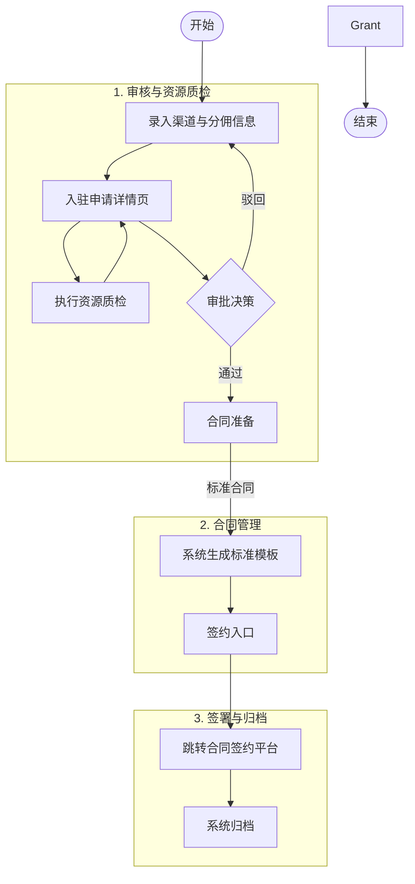
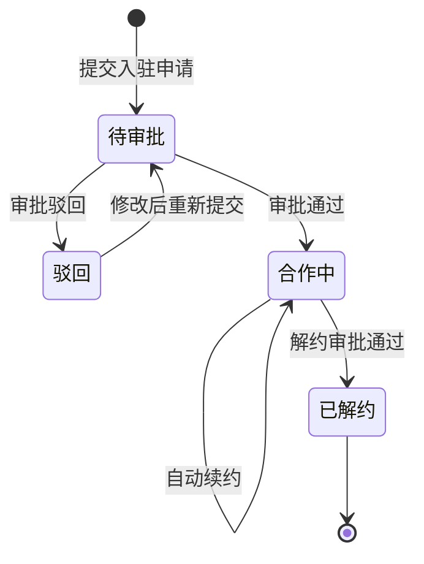
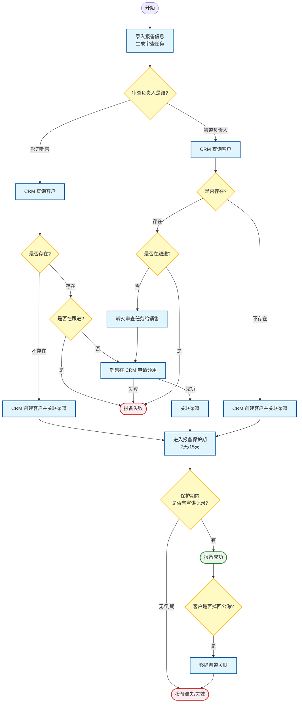
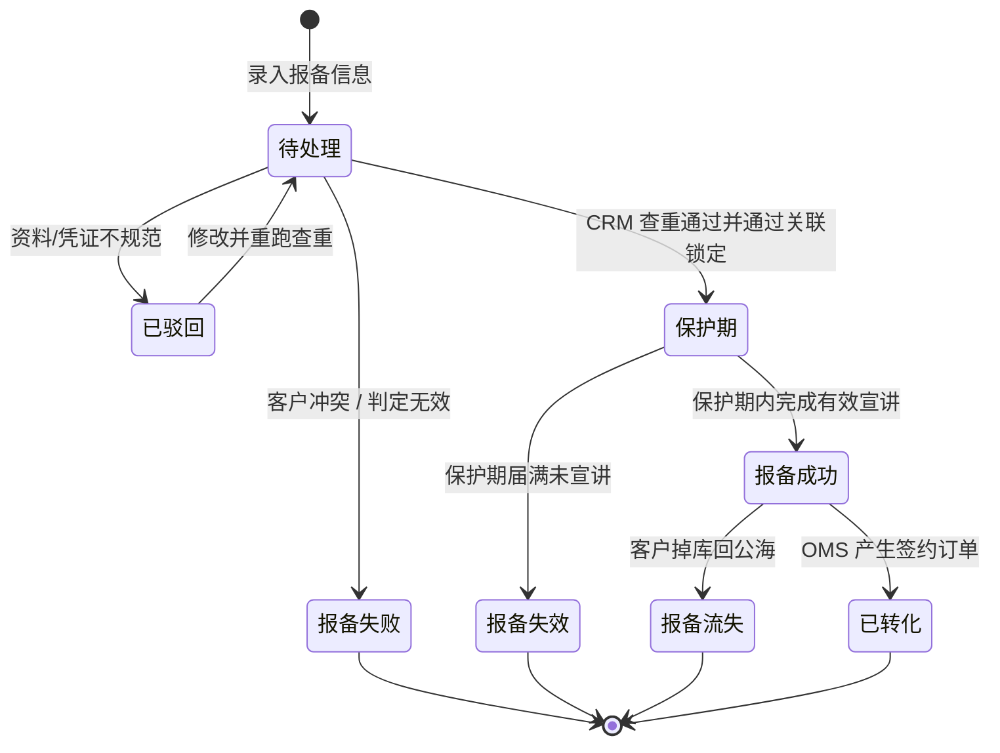
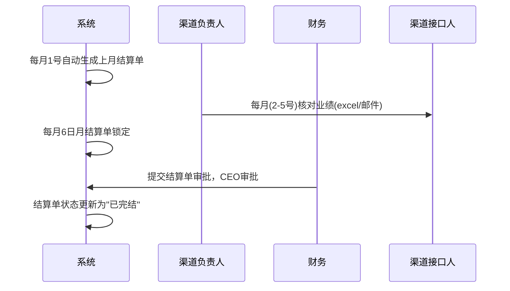

# 渠道管理系统产品需求文档 (PRD)

## 1. 项目背景与目标

### 1.1 业务背景

公司通过渠道合作伙伴拓展市场，当前渠道管理存在以下痛点：

- **渠道准入混乱**：缺乏标准化的入驻审批流程，资质审核依赖线下沟通。
- **客户归属争议**：渠道间撞单频繁，缺乏有效的客户保护机制。
- **业绩核算滞后**：人工统计业绩与分佣，易出错且效率低。

### 1.2 功能目标

构建渠道管理系统，覆盖从渠道招募入驻、客户报备保护、业绩自动核算到合作终止的核心流程。

## 2. 角色与权限

| 角色 | 职责描述 | 核心操作权限 |
| --- | --- | --- |
| 渠道接口人 | 渠道方的人员，负责日常的客户报备工作，渠道的对接工作 | 发起入驻、录入报备、核对月度业绩 |
| 渠道负责人 | 影刀方的渠道管理人员，负责渠道的引入与报备发起 | 发起入驻、录入报备、核对月度业绩、发起解约 |
| 渠道TL | 业务管理者，把控准入评审与审批 | 入驻审批、报备评审（查重）、解约审批 |
| 渠道中台 | 规则监督者 | 日常数据巡检、规则配置维护、渠道合同审批 |

---

## 3. 总体架构

### 3.2 核心业务流程

#### 3.2.1 渠道入驻与合同管理流程

**渠道状态流转**

#### 3.2.2 客户报备流程

> **使用说明**：
当前阶段不支持渠道接口人直接发起报备，因此需要渠道负责人/影刀销售代为发起报备。
1. 如果渠道接口人没有直接对接的销售，渠道负责人代渠道接口人发起客户报备。
2. 如果渠道接口人有直接对接的销售，渠道接口人发起客户报备。
3. 系统会自动查重，如果查重失败，报备失败。

> **报备流程**: 
1. 渠道接口人提供客户报备信息给影刀渠道负责人/影刀销售
2. 影刀渠道负责人/影刀销售，在渠道系统中报备客户信息，报备信息可以指定推荐的销售(文本输入)，生成客户报备审查任务，审查任务的负责人在创建者自己。
3. 审查任务负责人在CRM系统中查询客户是否存在，如果客户不存在则在CRM系统创建客户，关联渠道。
4. 如果客户已经存在，并且有在正常跟进中，那么报备失败。
5. 如果客户存在，但是不在正常跟进中，如果当前审查任务负责人是渠道负责人，则转交审查任务给影刀销售。
5. 销售处理流程：在CRM系统中申请认领客户到自己名下，成功后关联渠道；
6. 如果客户关联上渠道，则客户报备进入保护期(500人以下的可以保护7天，500人以上的可以保护15天)，如果客户在保护期内，销售有宣讲类型的跟进记录，则报备成功，超过保护期，报备失败。
7. CRM客户关联渠道后，发送消息给渠道系统，渠道系统修改相关数据。
8. 如果客户掉库(回到公海)，则移除客户关联的渠道，报备状态变为报备流失。

有效报备判断逻辑：
1. 有效跟进判断逻辑：根据客户下的销售跟进记录来判断，需要跟进记录类型为宣讲，且创建宣讲记录的时候，客户已经和渠道关联上。这个标签可以先打上，但是不一定使用。
2. 如果客户关联上渠道，则存在审批中的报备任务，客户名称和报备的客户名称一致，则自动报备成功。
3. 如果客户报备关联的客户A，被合并进入了另外一个客户B下，且客户B也关联了这个渠道，则在客户B的订单，也会算作客户订单。

问题：如果没有报备任务，但是客户关联了渠道，是否算作报备成功？目前是没有这个逻辑，只要客户关联了渠道，然后成单，就算作渠道的订单。

**报备状态流转**

客户报备状态说明：

| 状态 | 说明 | 触发/变更逻辑 |
| --- | --- | --- |
| **待处理** | 报备申请已提交，等待负责人进行 CRM 查重与评审。 | 提交报备后的初始状态。 |
| **已驳回** | 报备申请资料不全、凭证模糊或信息有误。 | 负责人评审驳回，支持修改后重新提交。 |
| **报备失败** | 报备申请未通过查重冲突检查或被判定为无效报备。 | 查重发现客户正在跟进中，或负责人执行“判定无效”。 |
| **保护期** | 客户已在 CRM 中成功关联渠道，进入权益保护计时。 | 通过查重并成功在 CRM 完成客户领用/创建及渠道关联。 |
| **报备成功** | 报备权益正式由于有效跟进（宣讲完成）而生效。 | 在保护期内（7/15天）完成宣讲类跟进，且经系统判定有效。 |
| **报备失效** | 报备权益在保护期内未达标而自动解除。 | 保护期届满仍未完成宣讲，报备失效。 |
| **报备流失** | 曾报备成功的客户资源因掉库而解除关联。 | 报备成功后，客户掉入 CRM 公海，系统自动移除关联。 |
| **已转化** | 报备成功且最终达成业务合同签约并回款。 | 报备成功后，客户产生已签约的订单（OMS 同步）。 |

> **说明**：报备提交后由渠道负责人评审。评审通过且查重通过（CRM 无此客户或不冲突）后，客户进入“保护期”并完成 CRM 关联。销售在保护期内完成有效的宣讲记录后，状态变更为“报备成功”。若保护期届满未宣讲，则自动“报备失效”；若已成功的报备客户掉入公海，则变为“报备流失”。

#### 3.2.3 月度结算流程

